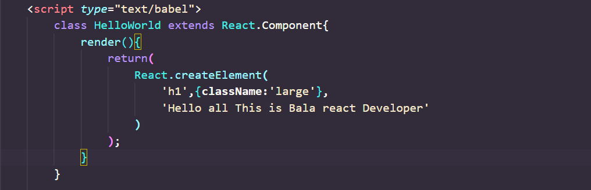
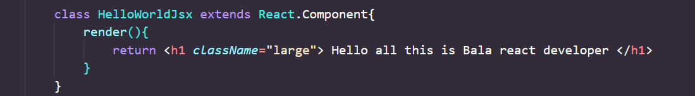
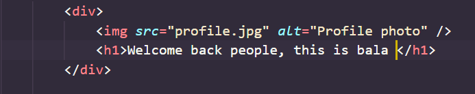

# DAY_2
# Date 27 June 2023 

# Component creation with and without JSX

**HelloWorld Component without JSX**


## During the component creation without the use of jsx, We are supposed to use the CreateElement function to create and element ans assign a value which will be more complex when it comes to many elements. but Instead we can do the following. 


## The same code is written with JSX in a simple manner. Which makes the code easier and more understandable. 

# The JavaScript is delivered to the browser after JSX 

## Consider the following code 


## The above code snipped is transpiled into the following 

```
React.CreateElement("div,null,
React.creatElement("img",{src:"profile.jpg",alt:"profile Photo"}),
React.createElement(
    "h1",null,"Welcome Back everyone, this is bala 
))
```

## I learnt the difference hope you did too.