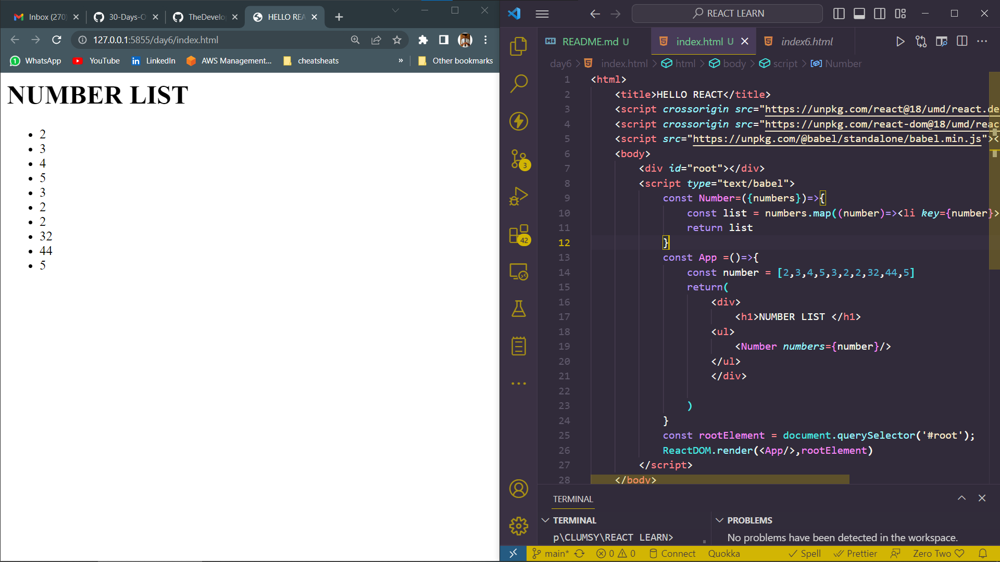
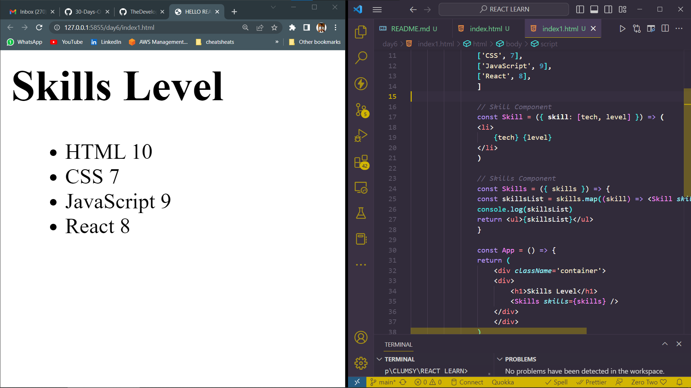
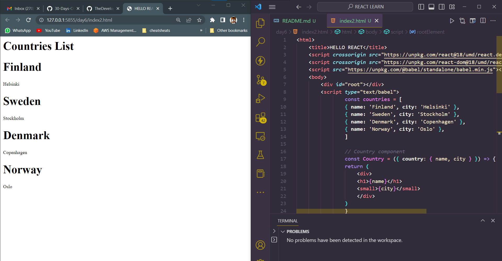

# DAY_6
# Date 01 July 2023 

# Mapping Arrays
**An array is the most frequently used data structure to handle many kinds of problems. In React, we use map to modify an array to list of JSX by adding a certain HTML elements to each element of an array.**

# Mapping and rendering arrays
*Most of the time data is in the form of an array or an array of objects. To render this array or array of objects most of the time we modify the data using map.*

# Mapping array of arrays 

# Mapping array of objects 
*Rendering array of objects*

