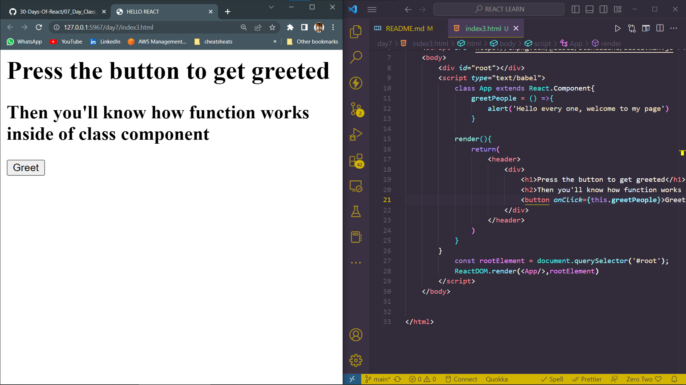

# DAY_7
# Date 02 July 2023 

# CLASS COMPONENTS

**Let us make also class based component. Class based component is made using JavaScript class and it inherits from react Component.**

*First we should know the different between functional react component and Class based react component*

## Functional React Component

```
import React from 'react';
import ReactDOM from 'react-dom';

const Header=()={
    <header>
    <div className="header-wrapper">
        <h1>Hello all welcome</h1>
    </div>
    </header>
}
const rootElement = document.getElementById('root');
ReactDOM.render(<Header/>,rootElement)
```

## Class based React Component is a child of React.Component and it has a built-in render method and it may have a constructor. 

```
import React from 'react';
import ReactDOM from 'react-dom';

class Header extends React.Component{
    render(){
    <header>
    <div className="header-wrapper">
        <h1>Hello all welcome</h1>
    </div>
    </header>
    }
}
const rootElement = document.getElementById('root')
ReactDOM.render(<Header />, rootElement)
```

## Class components with CONSTRUCTOR inside 
```
import React from 'react';
import ReactDOM from 'react-dom';

class Header extends React.Component{
    constructor(props){
        super(props)
        // THE CODE THAT WE PLACE HERE WILL EXECUTE ON FIRST HAND
    }
    render(){
    <header>
    <div className="header-wrapper">
        <h1>Hello all welcome</h1>
    </div>
    </header>
    }
    
}
const rootElement= document.getElementById('root');
React.render(<Header/>,rootElement);
```

*conversion of functional component to class component in react*
```
// TechList Component
// functional component
const TechList = () => {
  const techs = ['HTML', 'CSS', 'JavaScript']
  const techsFormatted = techs.map((tech) => <li key={tech}>{tech}</li>)
  return techsFormatted
}

// TechList Component
// class base component
class TechList extends React.Component {
  constructor(props) {
    super(props)
  }
  render() {
    const techs = ['HTML', 'CSS', 'JavaScript']
    const techsFormatted = techs.map((tech) => <li key={tech}>{tech}</li>)
    return techsFormatted
  }
}

// Main Component
// Functional Component
const Main = () => (
  <main>
    <div className='main-wrapper'>
      <p>Prerequisite to get started react.js:</p>
      <ul>
        <TechList />
      </ul>
    </div>
  </main>
)

// Main Component
// Class Component
class Main extends React.Component {
  constructor(props) {
    super(props)
  }
  render() {
    return (
      <main>
        <div className='main-wrapper'>
          <p>Prerequisite to get started react.js:</p>
          <ul>
            <TechList />
          </ul>
        </div>
      </main>
    )
  }
}

// Footer Component
// Functional component
const Footer = () => (
  <footer>
    <div className='footer-wrapper'>
      <p>Copyright 2020</p>
    </div>
  </footer>
)

// Footer Component
// Class component
class Footer extends React.Component {
  constructor(props) {
    super(props)
  }
  render() {
    return (
      <footer>
        <div className='footer-wrapper'>
          <p>Copyright 2020</p>
        </div>
      </footer>
    )
  }
}

// The App, or the parent or the container component
// Functional Component
const App = () => (
  <div className='app'>
    <Header />
    <Main />
    <Footer />
  </div>
)

// The App, or the parent or the container component
// Class Component
class App extends React.Component {
  constructor(props) {
    super(props)
  }
  render() {
    return (
      <div className='app'>
        <Header />
        <Main />
        <Footer />
      </div>
    )
  }
}
```
*Output of the above*


## Accessing props in Class components 

```

<html>
    <title>HELLO REACT</title>
    <script crossorigin src="https://unpkg.com/react@17/umd/react.development.js"></script>
    <script crossorigin src="https://unpkg.com/react-dom@17/umd/react-dom.development.js"></script>
    <script src="https://unpkg.com/@babel/standalone/babel.min.js"></script>
    <body>
        <div id="root"></div>
        <script type="text/babel">
            class Header extends React.Component{
                constructor(props){
                    super(props)
                }
                render(){
                    const {
                        welcome,
                        name
                    } = this.props.data;
                    return(
                        <header>
                            <div>
                                {welcome} {name}
                            </div>
                            
                        </header>
                    )
                }
            }
            class App extends React.Component{
                // constructor(props){
                //     super(props)
                // }
                render(){
                    const data= {
                    welcome :"I welcome ",
                    name:"you my friends."
                }
                return(
                    <div>
                        <Header data={data}/>
                    </div>
                )

                }  
            }
            const rootElement = document.querySelector('#root');
            ReactDOM.render(<App/>,rootElement)
        </script>
    </body>


</html>
```
*output of the above*


## Methods in a class based components 
```

<html>
    <title>HELLO REACT</title>
    <script crossorigin src="https://unpkg.com/react@17/umd/react.development.js"></script>
    <script crossorigin src="https://unpkg.com/react-dom@17/umd/react-dom.development.js"></script>
    <script src="https://unpkg.com/@babel/standalone/babel.min.js"></script>
    <body>
        <div id="root"></div>
        <script type="text/babel">
            class App extends React.Component{
                greetPeople = () =>{
                    alert('Hello every one, welcome to my page')
                }
            
            render(){
                return(
                    <header>
                        <div>
                            <h1>Press the button to get greeted</h1>
                            <h2>Then you'll know how function works inside of class component</h2>
                            <button onClick={this.greetPeople}>Greet</button>
                        </div>
                    </header>
                )
            }
        }
            const rootElement = document.querySelector('#root');
            ReactDOM.render(<App/>,rootElement)
        </script>
    </body>


</html>
```
*Output of the above*



## Everything all at once
```

<html>
    <title>HELLO REACT</title>
    <script crossorigin src="https://unpkg.com/react@17/umd/react.development.js"></script>
    <script crossorigin src="https://unpkg.com/react-dom@17/umd/react-dom.development.js"></script>
    <script src="https://unpkg.com/@babel/standalone/babel.min.js"></script>
    <body>
        <div id="root"></div>
        <script type="text/babel">
            // User Card Component
                    const UserCard = ({ user: { firstName, lastName } }) => (
                    <div className='user-card'>
                        
                        <h2>
                        {firstName}
                        {lastName}
                        </h2>
                    </div>
                    )

                    // A button component
                    const Button = ({ text, onClick, style }) => (
                    <button style={style} onClick={onClick}>
                        {text}
                    </button>
                    )

                    // CSS styles in JavaScript Object
                    const buttonStyles = {
                    backgroundColor: '#61dbfb',
                    padding: 10,
                    border: 'none',
                    borderRadius: 5,
                    margin: 3,
                    cursor: 'pointer',
                    fontSize: 18,
                    color: 'white',
                    }

                    // class based component
                    class Header extends React.Component {
                    constructor(props) {
                        super(props)
                        // the code inside the constructor run before any other code
                    }
                    render() {
                        console.log(this.props.data)
                        const {
                        welcome,
                        title,
                        subtitle,
                        author: { firstName, lastName },
                        date,
                        } = this.props.data

                        return (
                        <header>
                            <div className='header-wrapper'>
                            <h1>{welcome}</h1>
                            <h2>{title}</h2>
                            <h3>{subtitle}</h3>
                            <p>
                                {firstName} {lastName}
                            </p>
                            <small>{date}</small>
                            </div>
                        </header>
                        )
                    }
                    }

                    // TechList Component
                    // class base component
                    class TechList extends React.Component {
                    constructor(props) {
                        super(props)
                    }
                    render() {
                        const { techs } = this.props
                        const techsFormatted = techs.map((tech) => <li key={tech}>{tech}</li>)
                        return techsFormatted
                    }
                    }

                    // Main Component
                    // Class Component
                    class Main extends React.Component {
                    constructor(props) {
                        super(props)
                    }
                    render() {
                        return (
                        <main>
                            <div className='main-wrapper'>
                            <p>Prerequisite to get started react.js:</p>
                            <ul>
                                <TechList techs={this.props.techs} />
                            </ul>
                            <UserCard user={this.props.user} />
                            <Button
                                text='Greet People'
                                onClick={this.props.greetPeople}
                                style={buttonStyles}
                            />
                            <Button
                                text='Show Time'
                                onClick={this.props.handleTime}
                                style={buttonStyles}
                            />
                            </div>
                        </main>
                        )
                    }
                    }

                    // Footer Component
                    // Class component
                    class Footer extends React.Component {
                    constructor(props) {
                        super(props)
                    }
                    render() {
                        return (
                        <footer>
                            <div className='footer-wrapper'>
                            <p>Copyright {this.props.date.getFullYear()}</p>
                            </div>
                        </footer>
                        )
                    }
                    }

                    class App extends React.Component {
                    showDate = (time) => {
                        const months = [
                        'January',
                        'February',
                        'March',
                        'April',
                        'May',
                        'June',
                        'July',
                        'August',
                        'September',
                        'October',
                        'November',
                        'December',
                        ]

                        const month = months[time.getMonth()].slice(0, 3)
                        const year = time.getFullYear()
                        const date = time.getDate()
                        return ` ${month} ${date}, ${year}`
                    }
                    handleTime = () => {
                        alert(this.showDate(new Date()))
                    }
                    greetPeople = () => {
                        alert('Welcome to 30 Days Of React Challenge, 2020')
                    }
                    render() {
                        const data = {
                        welcome: 'Welcome to 30 Days Of React',
                        title: 'Getting Started React',
                        subtitle: 'JavaScript Library',
                        author: {
                            firstName: 'Bala',
                            lastName: 'Murugan',
                        },
                        date: 'July 02 2023',
                        }
                        const techs = ['HTML', 'CSS', 'JavaScript']

                        // copying the author from data object to user variable using spread operator
                        const user = { ...data.author }

                        return (
                        <div className='app'>
                            <Header data={data} />
                            <Main
                            user={user}
                            techs={techs}
                            handleTime={this.handleTime}
                            greetPeople={this.greetPeople}
                            />

                            <Footer date={new Date()} />
                        </div>
                        )
                    }
                    }

            const rootElement = document.querySelector('#root');
            ReactDOM.render(<App/>,rootElement)
        </script>
    </body>


</html>
```
*output of the above*


**Most of the time the container or the parent component can be written as class component and others as functional or presentational components. Data usually flows from parent components to child component and it is unidirectional. However, the latest version of react can allow us to write every component in our application only with functional components.**


