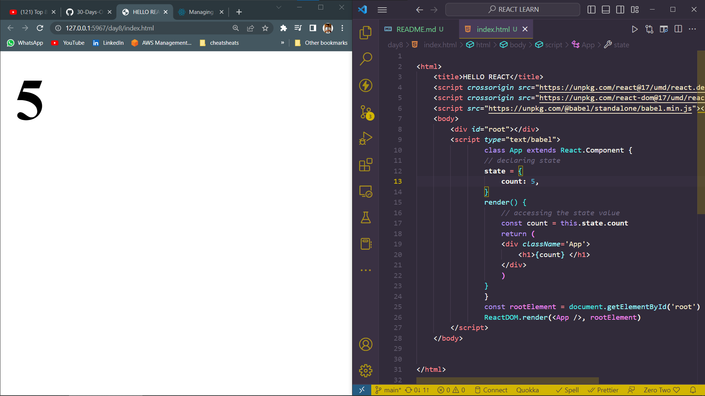
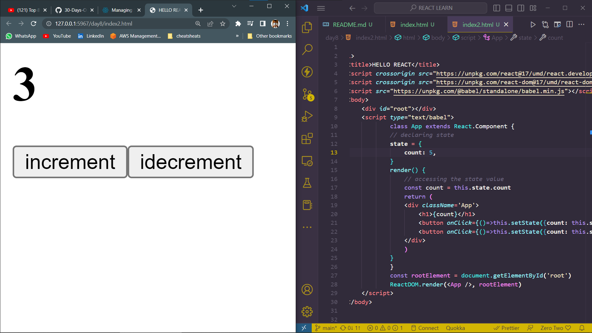
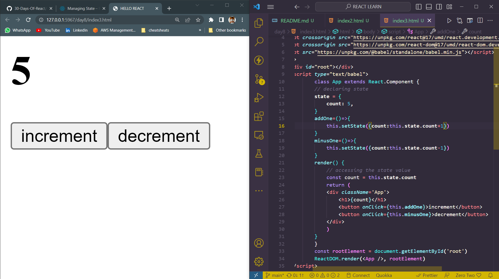
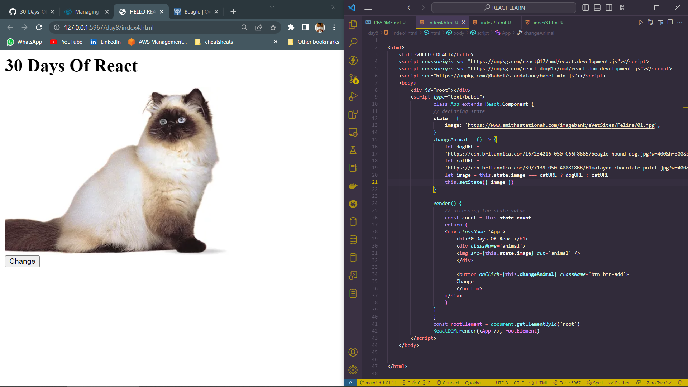
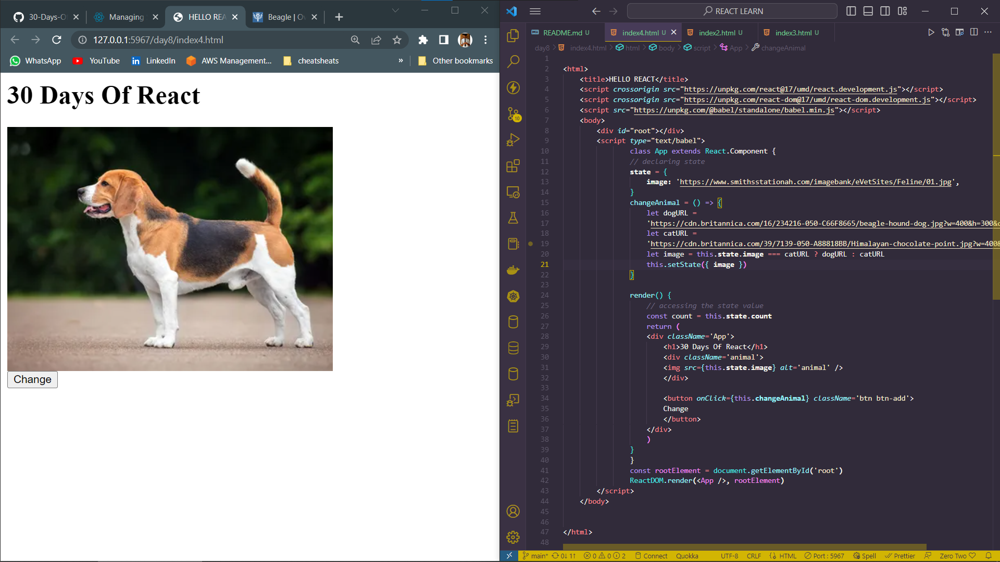

# DAY_8
# Date 03 July 2023 

# REACT STATES 
**What exactly is a state means? The English meaning of state is the particular condition that someone or something is in at a specific time.**

## How to set a state in react ?
**We set an initial state inside the constructor or outside the constructor of a class based component. We do not directly change or mutate the state but we use the setState() method to reset to a new state. . As you can see below in the state object we have count with initial value 0. We can access the state object using this.state and the property name. See the example below.**

```
import React from 'react';
import ReactDOM from 'react-dom';

class App from React.component{
    state={
        count:0;
    }
    const count=this.state.count;
    render(){
        return(
                    <div>
            <h1>{count}</h1>
        </div>
        )

    }
    const rootElement = document.getElementById('#root');
    ReactDOM.render(<App/>,rootElement)

}
```
*output of the above*


*As you can see in the browser. We can increase or decrease the value the state by changing the value of the state using JavaScript method manually.*

## Resetting a state using a javascript method 
*Now, let's add some methods which increase or decrease the value of count by clicking a button. Let us add a button to increase and a button to decrease the value of count. To set the state we use react method this.setState. See the example below*
```

<html>
    <title>HELLO REACT</title>
    <script crossorigin src="https://unpkg.com/react@17/umd/react.development.js"></script>
    <script crossorigin src="https://unpkg.com/react-dom@17/umd/react-dom.development.js"></script>
    <script src="https://unpkg.com/@babel/standalone/babel.min.js"></script>
    <body>
        <div id="root"></div>
        <script type="text/babel">
                class App extends React.Component {
                // declaring state
                state = {
                    count: 5,
                }
                render() {
                    // accessing the state value
                    const count = this.state.count
                    return (
                    <div className='App'>
                        <h1>{count}</h1>
                        <button onClick={()=>this.setState({count: this.state.count+=1})}>increment</button>
                        <button onClick={()=>this.setState({count: this.state.count-=1})}>idecrement</button>
                    </div>
                    )
                }
                }
                const rootElement = document.getElementById('root')
                ReactDOM.render(<App />, rootElement)
        </script>
    </body>


</html>
```

*output of the above*


## Doing the state change stuff inside button is not a good practice to make it as  separate function

```

<html>
    <title>HELLO REACT</title>
    <script crossorigin src="https://unpkg.com/react@17/umd/react.development.js"></script>
    <script crossorigin src="https://unpkg.com/react-dom@17/umd/react-dom.development.js"></script>
    <script src="https://unpkg.com/@babel/standalone/babel.min.js"></script>
    <body>
        <div id="root"></div>
        <script type="text/babel">
                class App extends React.Component {
                // declaring state
                state = {
                    count: 5,
                }
                addOne=()=>{
                    this.setState({count:this.state.count+1})
                }
                minusOne=()=>{
                    this.setState({count:this.state.count-1})
                }
                render() {
                    // accessing the state value
                    const count = this.state.count
                    return (
                    <div className='App'>
                        <h1>{count}</h1>
                        <button onClick={this.addOne}>increment</button>
                        <button onClick={this.minusOne}>decrement</button>
                    </div>
                    )
                }
                }
                const rootElement = document.getElementById('root')
                ReactDOM.render(<App />, rootElement)
        </script>
    </body>


</html>
```
*output of the above*



# Examples 
```

<html>
    <title>HELLO REACT</title>
    <script crossorigin src="https://unpkg.com/react@17/umd/react.development.js"></script>
    <script crossorigin src="https://unpkg.com/react-dom@17/umd/react-dom.development.js"></script>
    <script src="https://unpkg.com/@babel/standalone/babel.min.js"></script>
    <body>
        <div id="root"></div>
        <script type="text/babel">
                class App extends React.Component {
                // declaring state
                state = {
                    image: 'https://www.smithsstationah.com/imagebank/eVetSites/Feline/01.jpg',
                }
                changeAnimal = () => {
                    let dogURL =
                    'https://cdn.britannica.com/16/234216-050-C66F8665/beagle-hound-dog.jpg?w=400&h=300&c=crop'
                    let catURL =
                    'https://cdn.britannica.com/39/7139-050-A88818BB/Himalayan-chocolate-point.jpg?w=400&h=300&c=crop'
                    let image = this.state.image === catURL ? dogURL : catURL
                    this.setState({ image })
                }

                render() {
                    // accessing the state value
                    const count = this.state.count
                    return (
                    <div className='App'>
                        <h1>30 Days Of React</h1>
                        <div className='animal'>
                        
                        </div>

                        <button onClick={this.changeAnimal} className='btn btn-add'>
                        Change
                        </button>
                    </div>
                    )
                }
                }
                const rootElement = document.getElementById('root')
                ReactDOM.render(<App />, rootElement)
        </script>
    </body>


</html>


```

