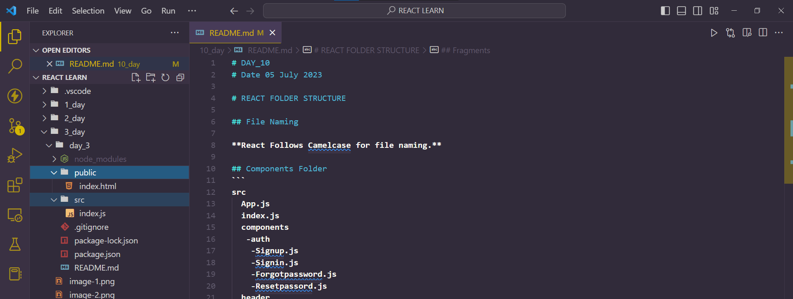

# DAY_10
# Date 05 July 2023 

# REACT FOLDER STRUCTURE

## File Naming 

**React Follows Camelcase for file naming.**

## Components Folder 
```
src
  App.js
  index.js
  components
   -auth
    -Signup.js
    -Signin.js
    -Forgotpassword.js
    -Resetpassord.js
  header
   -Header.js
  footer
   -Footer.js
  assets
   -images
   -icnons
   - fonts
  styles
   -button.js
   -button.scss
 utils
  -random-id.js
  -display-time.js
  -generate-color.js
 shared
  -Button.js
  -InputField.js
  -TextAreaField.js
```

## Fragments 
```
import React, { Fragment } from 'react'

const Skills = () => {
  return (
    <Fragment>
      <li>HTML</li>
      <li>CSS</li>
      <li>JavaScript</li>
    </Fragment>
  )
}
const RequiredSkills = () => {
  return (
    <ul>
      <Skills />
    </ul>
  )
}
```

## Picture 


