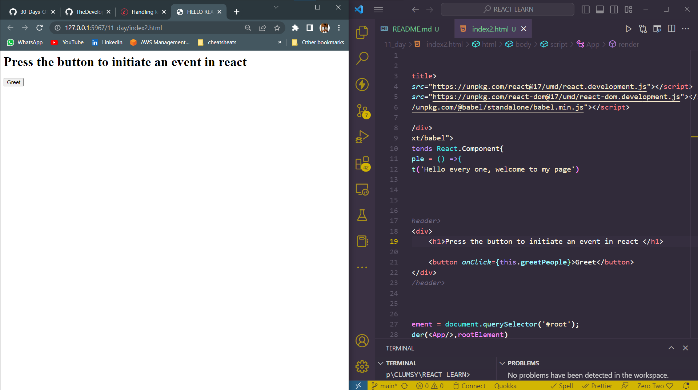

# DAY_11
# Date 06 July 2023 

# REACT EVENTS 
**An event is an action or occurrence recognized by a software. To make an event more clear let's use the daily activities we do when we use a computer such as clicking on a button, hover on an image, pressing a keyboard, scrolling the mouse wheel and etc. In this section, we will focus only some of the mouse and keyboard events.Handling events in React is very similar to handling elements on DOM elements using pure JavaScript. Some of the syntax difference between handling event in React and pure JavaScript:**

- React events are named using camelCase, rather than lowercase.
- With JSX you pass a function as the event handler, rather than a string.

## Various Events 


*Example for event handling*

```
    <!DOCTYPE html>
    <html lang="en">
    <head>
        <meta charset="UTF-8">
        <meta name="viewport" content="width=device-width, initial-scale=1.0">
        <title>Document</title>
    </head>
    <body>
        <h1>EVENT HANDLING </h1>
        <button onclick="greet()">CLICK</button>
        <script>
            const greet=()=>{
                return alert("hello people")
            }
        </script>
        
    </body>
    </html>
```


*output*


## React Event Handling 
```

<html>
    <title>HELLO REACT</title>
    <script crossorigin src="https://unpkg.com/react@17/umd/react.development.js"></script>
    <script crossorigin src="https://unpkg.com/react-dom@17/umd/react-dom.development.js"></script>
    <script src="https://unpkg.com/@babel/standalone/babel.min.js"></script>
    <body>
        <div id="root"></div>
        <script type="text/babel">
            class App extends React.Component{
                greetPeople = () =>{
                    alert('Hello every one, welcome to my page')
                }
            
            render(){
                return(
                    // <header>
                        <div>
                            <h1>Press the button to get greeted</h1>
                            <h2>Then you'll know how function works inside of class component</h2>
                            <button onClick={this.greetPeople}>Greet</button>
                        </div>
                    // </header>
                )
            }
        }
            const rootElement = document.querySelector('#root');
            ReactDOM.render(<App/>,rootElement)
        </script>
    </body>


</html>
```

*output of the above*




## React code for simple data collection from user
```
<!DOCTYPE html>
<html lang="en">
<head>
    <script crossorigin src="https://unpkg.com/react@17/umd/react.development.js"></script>
    <script crossorigin src="https://unpkg.com/react-dom@17/umd/react-dom.development.js"></script>
    <script src="https://unpkg.com/@babel/standalone/babel.min.js"></script>
    <title>Document</title>
</head>
<body>
    <div id="root"></div>
    <script type="text/babel">
            const App = () => {
            const [inputValue, setInputValue] = React.useState('');

            const handleClick = () => {
                const input = document.getElementById('myInput');
                const value = input.value;
                setInputValue(value);
            };

            return (
                <div>
                <input type="text" id="myInput" />
                <button onClick={handleClick}>Submit</button>
                <p>Input value: {inputValue}</p>
                </div>
            );
            };
            const rootElement = document.getElementById('root')
            ReactDOM.render(<App />, rootElement)
    </script>
</body>
</html>
```
*Output of the above *


