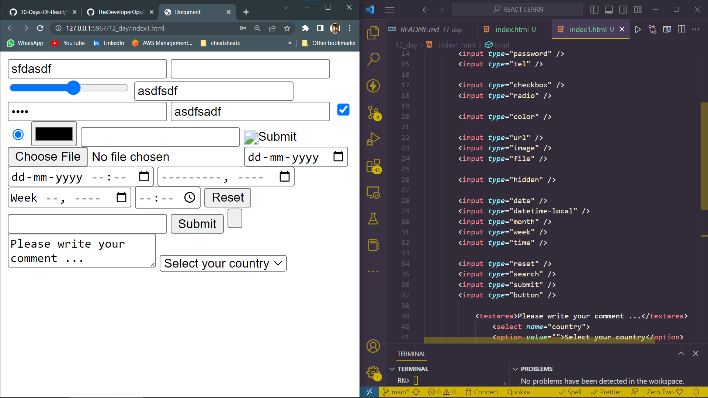
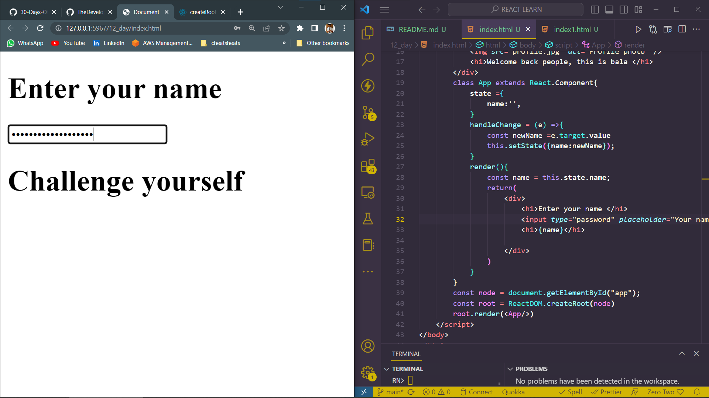

# DAY_12
# Date 06 July 2023 

# REACT FORMS 

**Form is used to collect data from a user. Once in a while we use form to fill our information on a paper or on a website. Either to sign up, sign in or to apply for a job we fill different form fields to submit our data to remote database. We encounter different form fields when we fill a form such as simple text, email, password, telephone, date, checkbox, radio button, option selection and text area field. Currently, HTML5 has provide quite a lot of field types. You may have a look at the following available HTML5 input types**

```
<input type="text" />
<input type="number" />
<input type="range" />

<input type="email" />
<input type="password" />
<input type="tel" />

<input type="checkbox" />
<input type="radio" />

<input type="color" />

<input type="url" />
<input type="image" />
<input type="file" />

<input type="hidden" />

<input type="date" />
<input type="datetime-local" />
<input type="month" />
<input type="week" />
<input type="time" />

<input type="reset" />
<input type="search" />
<input type="submit" />
<input type="button" />
```

## Another HTML fields to get data from a form are textarea and select with options elements. 

```
<textarea>Please write your comment ...</textarea>

<select name="country">
  <option value="">Select your country</option>
  <option value="finland">Finland</option>
  <option value="sweden">Sweden</option>
  <option value="denmark">Denmark</option>
  <option value="norway">Norway</option>
  <option value="iceland">Iceland</option>
</select>
```
*output from the above code*


## React Simple form 
```
<!DOCTYPE html>
<html lang="en">
<head>
    <meta charset="UTF-8">
    <meta name="viewport" content="width=device-width, initial-scale=1.0">
    <script crossorigin src="https://unpkg.com/react@18/umd/react.development.js"></script>
    <script crossorigin src="https://unpkg.com/react-dom@18/umd/react-dom.development.js"></script>
    <script src="https://unpkg.com/@babel/standalone/babel.min.js"></script>
    <title>Document</title>
</head>
<body>
    <div id="app"></div>
    <div id="app-jsx"></div>
    <script type="text/babel">
        <div>
            
            <h1>Welcome back people, this is bala </h1>
        </div>
        class App extends React.Component{
            state ={
                name:'',
            }
            handleChange = (e) =>{
                const newName =e.target.value
                this.setState({name:newName});
            }
            render(){
                const name = this.state.name;
                return(
                    <div>
                        <h1>Enter your name </h1>
                        <input type="password" placeholder="Your name please " value={name} onChange={this.handleChange}/>
                        <h1>{name}</h1>

                    </div>
                )
            }
        }
        const node = document.getElementById("app");
        const root = ReactDOM.createRoot(node)
        root.render(<App/>)
    </script>
</body>
</html>
```




