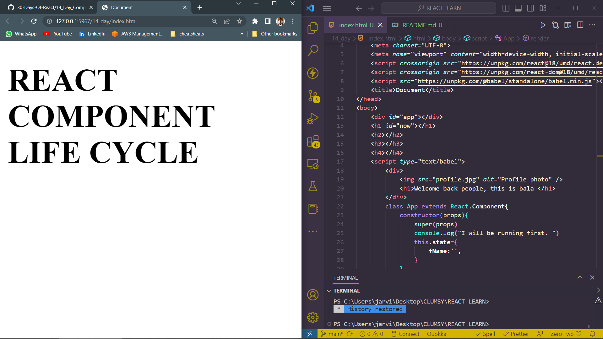
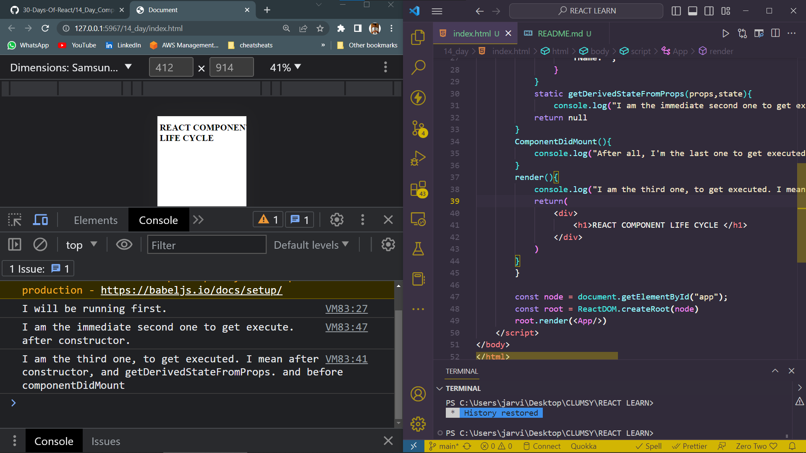
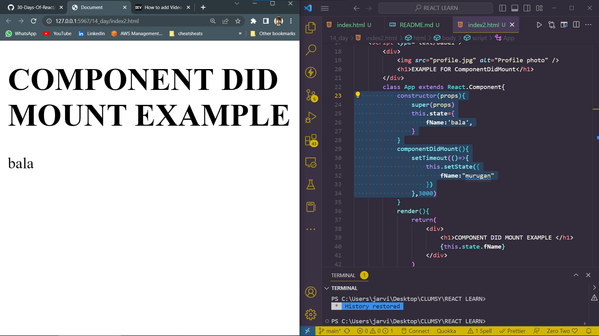
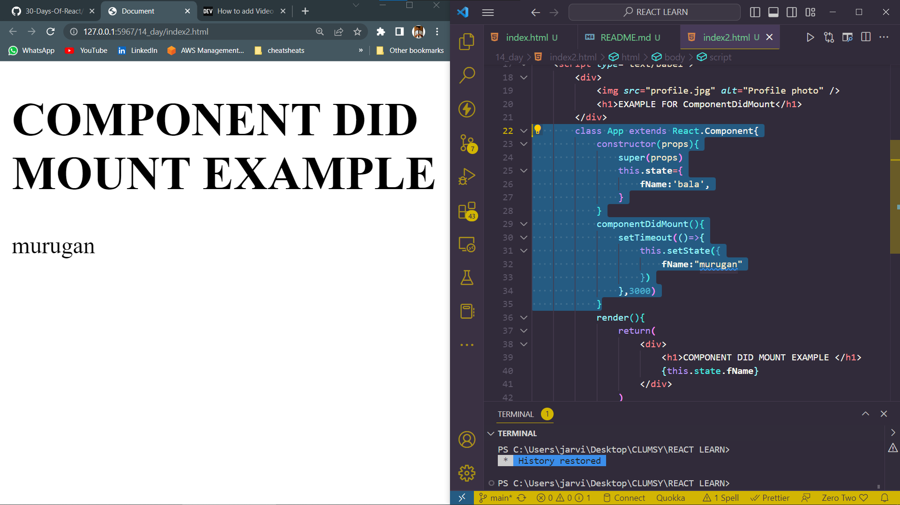
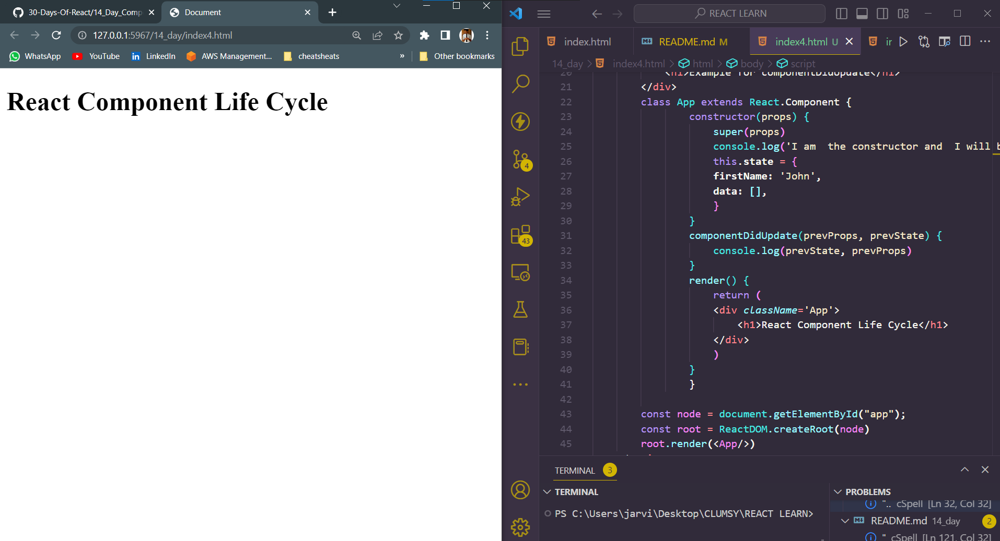

# DAY_14
# Date 09 July 2023 

# REACT COMPONENT LIFE CYCLES 

## What is component life cycle ? 

**Component life cycle is the process of mounting, updating, and destroying a component in a React application. We can associate a component life cycle with the process of human growth:birth,adult, elderly and death. In React component also a component can be mounted or rendered the first time, can be updated by changing the data and also can be destroyed whenever it is not needed. In React each component has three main phases.**

  - Mounting 
  - Updating 
  - Unmounting 

## Mounting 
**Rendering or putting React component into the DOM is called Mounting. The following built-in methods run in the given order during mounting of a React component.**

        1. Constructor()
        2. static getDeriveStateFromProps()
        3. render()
        4. componentDidMount()

**When we have been making a class-based component we used a built-in render method and it is required in all class-based components but other methods are optional. See the order of execution of the different methods by running the following snippet of codes.**

```
<!DOCTYPE html>
<html lang="en">
<head>
    <meta charset="UTF-8">
    <meta name="viewport" content="width=device-width, initial-scale=1.0">
    <script crossorigin src="https://unpkg.com/react@18/umd/react.development.js"></script>
    <script crossorigin src="https://unpkg.com/react-dom@18/umd/react-dom.development.js"></script>
    <script src="https://unpkg.com/@babel/standalone/babel.min.js"></script>
    <title>Document</title>
</head>
<body>
    <div id="app"></div>
    <h1 id="now"></h1>
    <h2></h2>
    <h3></h3>
    <h4></h4>
    <script type="text/babel">
        <div>
            
            <h1>Welcome back people, this is bala </h1>
        </div>
        class App extends React.Component{
            constructor(props){
                super(props)
                console.log("I will be running first. ")
                this.state={
                    fName:'',
                }
            }
            static getDerivedStateFromProps(props,state){
                console.log("I am the immediate second one to get execute. after constructor.")
            return null 
        }
        ComponentDidMount(){
            console.log("After all, I'm the last one to get executed after the whole component . ")
        }
        render(){
            console.log("I am the third one, to get executed. I mean after constructor, and getDerivedStateFromProps. and before componentDidMount")
            return(
                <div>
                    <h1>REACT COMPONENT LIFE CYCLE </h1>
                </div>
            )
        }
        }
        
        const node = document.getElementById("app");
        const root = ReactDOM.createRoot(node)
        root.render(<App/>)
    </script>
</body>
</html>
```

*OUTPUT OF THE ABOVE*



## getDerivedStateFromProps 

**As we can understand from the name, this method derives a state from props. The getDerivedStateFromProps() method is called right before rendering the component in the DOM. This the right place to set the state object based on the initial props.**

## componentDidMount

```
<!DOCTYPE html>
<html lang="en">
<head>
    <meta charset="UTF-8">
    <meta name="viewport" content="width=device-width, initial-scale=1.0">
    <script crossorigin src="https://unpkg.com/react@18/umd/react.development.js"></script>
    <script crossorigin src="https://unpkg.com/react-dom@18/umd/react-dom.development.js"></script>
    <script src="https://unpkg.com/@babel/standalone/babel.min.js"></script>
    <title>Document</title>
</head>
<body>
    <div id="app"></div>
    <h1 id="now"></h1>
    <h2></h2>
    <h3></h3>
    <h4></h4>
    <script type="text/babel">
        <div>
            
            <h1>EXAMPLE FOR ComponentDidMount</h1>
        </div>
        class App extends React.Component{
            constructor(props){
                super(props)
                this.state={
                    fName:'bala',
                }
            }
            componentDidMount(){
                setTimeout(()=>{
                    this.setState({
                        fName:"murugan"
                    })
                },3000)
            }
            render(){
                return(
                    <div>
                        <h1>COMPONENT DID MOUNT EXAMPLE </h1>
                        {this.state.fName}
                    </div>
                )
            }
        }
        const node = document.getElementById("app");
        const root = ReactDOM.createRoot(node)
        root.render(<App/>)
    </script>
</body>
</html>
```



## UPDATING 

**After a component has been mounted on the DOM, it can be updated when a state or props change. An update of a React component can be caused by changes to props or state . These methods are called in the following order when a component is being re-rendered:**

     1. static getDeriveStateFromProps()
     2. shouldComponentUpdate()
     3. render()
     4. getSnapshotBeforeUpdate()
     5. componentDidUpdate()

## shouldComponentUpdate
**The shouldComponentUpdate() built-in life cycle method should return a boolean. If this method does not return true the application will not update. If the method does not return true the application will never update. This can be used for instance to block use when it reaches to a certain point(game, subscription) or may be to block a certain user.**

*For instance, if we want to stop doing challenge after 30 days we can increment the day from 1 to 30 and we can block the application at day 30. Look the example.*

```
<!DOCTYPE html>
<html lang="en">
<head>
    <meta charset="UTF-8">
    <meta name="viewport" content="width=device-width, initial-scale=1.0">
    <script crossorigin src="https://unpkg.com/react@18/umd/react.development.js"></script>
    <script crossorigin src="https://unpkg.com/react-dom@18/umd/react-dom.development.js"></script>
    <script src="https://unpkg.com/@babel/standalone/babel.min.js"></script>
    <title>Document</title>
</head>
<body>
    <div id="app"></div>
    <h1 id="now"></h1>
    <h2></h2>
    <h3></h3>
    <h4></h4>
    <script type="text/babel">
        <div>
            
            <h1>EXAMPLE FOR shouldComponentUpdate</h1>
        </div>
        class App extends React.Component {
            constructor(props) {
                super(props)
                console.log('I am  the constructor and  I will be the first to run.')
                this.state = {
                firstName: 'John',
                day: 1,
                }
            }

            shouldComponentUpdate(nextProps, nextState) {
                console.log(nextProps, nextState)
                console.log(nextState.day)
                if (nextState.day > 31) {
                return false
                } else {
                return true
                }
            }
            // the doChallenge increment the day by one
            doChallenge = () => {
                this.setState({
                day: this.state.day + 1,
                })
            }
            render() {
                return (
                <div className='App'>
                    <h1>React Component Life Cycle</h1>
                    <button onClick={this.doChallenge}>Do Challenge</button>
                    <p>Challenge: Day {this.state.day}</p>
                    {this.state.congratulate && <h2>{this.state.congratulate}</h2>}
                </div>
                )
            }
            }

        const node = document.getElementById("app");
        const root = ReactDOM.createRoot(node)
        root.render(<App/>)
    </script>
</body>
</html>
```


## componentDidUpdate

**The componentDidUpdate method takes two parameters: the prevProps and prevState. It is called after the component is updated in the DOM.**

```
<!DOCTYPE html>
<html lang="en">
<head>
    <meta charset="UTF-8">
    <meta name="viewport" content="width=device-width, initial-scale=1.0">
    <script crossorigin src="https://unpkg.com/react@18/umd/react.development.js"></script>
    <script crossorigin src="https://unpkg.com/react-dom@18/umd/react-dom.development.js"></script>
    <script src="https://unpkg.com/@babel/standalone/babel.min.js"></script>
    <title>Document</title>
</head>
<body>
    <div id="app"></div>
    <h1 id="now"></h1>
    <h2></h2>
    <h3></h3>
    <h4></h4>
    <script type="text/babel">
        <div>
            
            <h1>Welcome back people, this is bala </h1>
        </div>
        class App extends React.Component {
                constructor(props) {
                    super(props)
                    console.log('I am  the constructor and  I will be the first to run.')
                    this.state = {
                    firstName: 'John',
                    data: [],
                    }
                }
                componentDidUpdate(prevProps, prevState) {
                    console.log(prevState, prevProps)
                }
                render() {
                    return (
                    <div className='App'>
                        <h1>React Component Life Cycle</h1>
                    </div>
                    )
                }
                }
        
        const node = document.getElementById("app");
        const root = ReactDOM.createRoot(node)
        root.render(<App/>)
    </script>
</body>
</html>

```
*ouput of the above*


## UNMOUNTING 

**The final phase in the lifecycle of a component is unmounting. The unmounting phase removes component from the DOM. The componentWillUnmount method is the only built-in method that gets called when a component is unmounted.**


