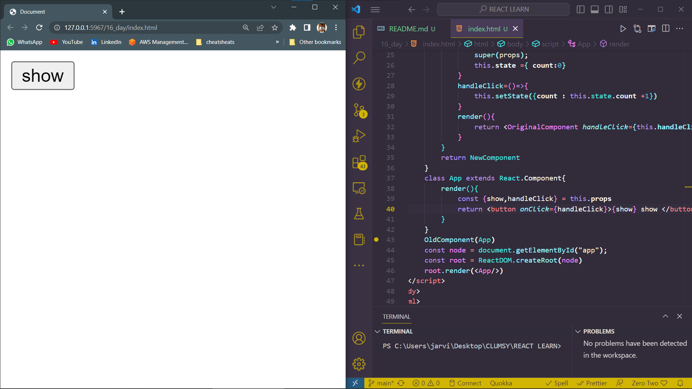
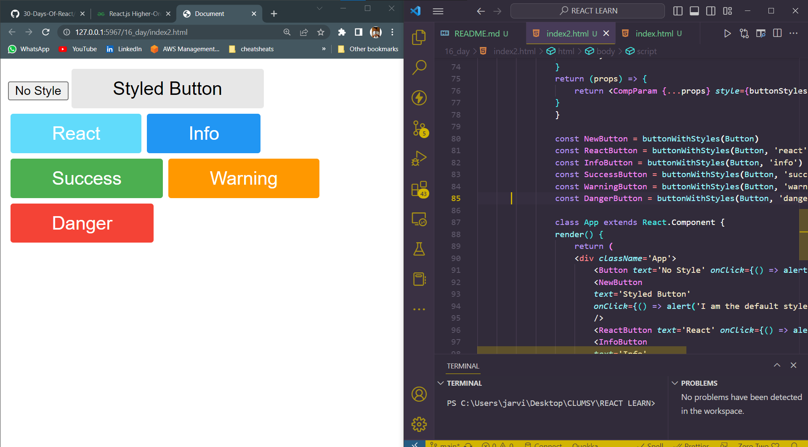

# DAY_16
# Date 11 July 2023 

# REACT HIGHER ORDER COMPONENT
**A higher-order component hoc is a function that takes a component and returns a new component. A higher-order component (HOC) is advanced technique in React.js for reusing a component logic. Higher-Order components are not part of the ReactAPI. They are the pattern that emerges from React's compositional nature. The component transforms props into UI,and a higher-order component converts a component into another component. The examples of HOCs are redux's connect and Relay's createContainer.**


## Higher Order component example
```
<!DOCTYPE html>
<html lang="en">
<head>
    <meta charset="UTF-8">
    <meta name="viewport" content="width=device-width, initial-scale=1.0">
    <script crossorigin src="https://unpkg.com/react@18/umd/react.development.js"></script>
    <script crossorigin src="https://unpkg.com/react-dom@18/umd/react-dom.development.js"></script>
    <script src="https://unpkg.com/@babel/standalone/babel.min.js"></script>
    <title>Document</title>
</head>
<body>
    <div id="app"></div>
    <h1 id="now"></h1>
    <h2></h2>
    <h3></h3>
    <h4></h4>
    <script type="text/babel">
        <div>
            
            <h1>Welcome back people, this is bala </h1>
        </div>
        const OldComponent=(OriginalComponent)=>{
            class NewComponent extends React.Component{
                constructor(props){
                    super(props);
                    this.state ={ count:0}
                }
                handleClick=()=>{
                    this.setState({count : this.state.count +1})
                }
                render(){
                    return <OriginalComponent handleClick={this.handleClick} show={this.state.count}/>
                }
            }
            return NewComponent
        }
        class App extends React.Component{
            render(){
                const {show,handleClick} = this.props
                return <button onClick={handleClick}>{show} show </button>
            }
        }
        OldComponent(App)
        const node = document.getElementById("app");
        const root = ReactDOM.createRoot(node)
        root.render(<App/>)
    </script>
</body>
</html>
```




## Higher order component for button 
```
<!DOCTYPE html>
<html lang="en">
<head>
    <meta charset="UTF-8">
    <meta name="viewport" content="width=device-width, initial-scale=1.0">
    <script crossorigin src="https://unpkg.com/react@18/umd/react.development.js"></script>
    <script crossorigin src="https://unpkg.com/react-dom@18/umd/react-dom.development.js"></script>
    <script src="https://unpkg.com/@babel/standalone/babel.min.js"></script>
    <title>Document</title>
</head>
<body>
    <div id="app"></div>
    <h1 id="now"></h1>
    <h2></h2>
    <h3></h3>
    <h4></h4>
    <script type="text/babel">
        <div>
            
            <h1>Welcome back people, this is bala </h1>
        </div>
        const Button = ({ onClick, text, style }) => {
                return (
                    <button onClick={onClick} style={style}>
                    {text}
                    </button>
                )
                }

                const buttonWithStyles = (CompParam, name = 'default') => {
                const colors = [
                    {
                    name: 'default',
                    backgroundColor: '#e7e7e7',
                    color: '#000000',
                    },
                    {
                    name: 'react',
                    backgroundColor: '#61dbfb',
                    color: '#ffffff',
                    },
                    {
                    name: 'success',
                    backgroundColor: '#4CAF50',
                    color: '#ffffff',
                    },
                    {
                    name: 'info',
                    backgroundColor: '#2196F3',
                    color: '#ffffff',
                    },
                    {
                    name: 'warning',
                    backgroundColor: '#ff9800',
                    color: '#ffffff',
                    },
                    {
                    name: 'danger',
                    backgroundColor: '#f44336',
                    color: '#ffffff',
                    },
                ]
                const { backgroundColor, color } = colors.find((c) => c.name === name)

                const buttonStyles = {
                    backgroundColor,
                    padding: '10px 45px',
                    border: 'none',
                    borderRadius: 3,
                    margin: 3,
                    cursor: 'pointer',
                    fontSize: '1.25rem',
                    color,
                }
                return (props) => {
                    return <CompParam {...props} style={buttonStyles} />
                }
                }

                const NewButton = buttonWithStyles(Button)
                const ReactButton = buttonWithStyles(Button, 'react')
                const InfoButton = buttonWithStyles(Button, 'info')
                const SuccessButton = buttonWithStyles(Button, 'success')
                const WarningButton = buttonWithStyles(Button, 'warning')
                const DangerButton = buttonWithStyles(Button, 'danger')

                class App extends React.Component {
                render() {
                    return (
                    <div className='App'>
                        <Button text='No Style' onClick={() => alert('I am not styled yet')} />
                        <NewButton
                        text='Styled Button'
                        onClick={() => alert('I am the default style')}
                        />
                        <ReactButton text='React' onClick={() => alert('I have react color')} />
                        <InfoButton
                        text='Info'
                        onClick={() => alert('I am styled with info color')}
                        />
                        <SuccessButton text='Success' onClick={() => alert('I am successful')} />
                        <WarningButton
                        text='Warning'
                        onClick={() => alert('I warn you many times')}
                        />
                        <DangerButton
                        text='Danger'
                        onClick={() => alert('Oh no, you can not restore it')}
                        />
                    </div>
                    )
                }
                }
        const node = document.getElementById("app");
        const root = ReactDOM.createRoot(node)
        root.render(<App/>)
    </script>
</body>
</html>
```

