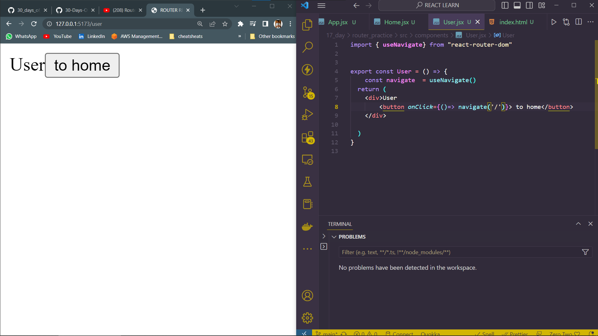

# DAY_17
# Date 12 July 2023 

# REACT ROUTER 

**React Router enables "client side routing".

In traditional websites, the browser requests a document from a web server, downloads and evaluates CSS and JavaScript assets, and renders the HTML sent from the server. When the user clicks a link, it starts the process all over again for a new page.

Client side routing allows your app to update the URL from a link click without making another request for another document from the server. Instead, your app can immediately render some new UI and make data requests with fetch to update the page with new information.**

**This enables faster user experiences because the browser doesn't need to request an entirely new document or re-evaluate CSS and JavaScript assets for the next page. It also enables more dynamic user experiences with things like animation.**

*Installation*
`$ npm install react-router-dom`

## <BrowserRouter>
**A `BrowserRouter` stores the current location in the browser's address bar using clean URLs and navigates using the browser's built-in history stack**

*Declaration*
```
import * as React from "react";
import { createRoot } from "react-dom/client";
import { BrowserRouter } from "react-router-dom";

const root = createRoot(document.getElementById("root"));

root.render(
  <BrowserRouter>
    {/* The rest of your app goes here */}
  </Bro
```

## <Route>
**Routes are perhaps the most important part of a React Router app. They couple URL segments to components, data loading and data mutations. Through route nesting, complex application layouts and data dependencies become simple and declarative.**

*Declaration*
```
const router = createBrowserRouter([
  {
    // it renders this element
    element: <Team />,

    // when the URL matches this segment
    path: "teams/:teamId",

    // with this data loaded before rendering
    loader: async ({ request, params }) => {
      return fetch(
        `/fake/api/teams/${params.teamId}.json`,
        { signal: request.signal }
      );
    },

    // performing this mutation when data is submitted to it
    action: async ({ request }) => {
      return updateFakeTeam(await request.formData());
    },

    // and renders this element in case something went wrong
    errorElement: <ErrorBoundary />,
  },
]);
```
## EXAMPLE 

*User.jsx*
```
export const User = () => {
  return (
    <div>User</div>
  )
}
```

*Home.jsx*
```
export const Home = () => {
  return (
    <div>Home</div>
  )
}
```

*App.jsx*
```
import {BrowserRouter, Route, Routes} from 'react-router-dom'
import { User } from './components/User'
import { Home } from './components/Home'
function App() {
  return (
    <div className="App">    
        <BrowserRouter>
        <Routes>
        <Route path='/' element={<Home/>}/>
        <Route path='/user/' element={<User/>}/>
        </Routes>
        </BrowserRouter>
    </div>
  )
}

export default App
```
*Output of the above*


## Linking components through <Link> tag

```
import { Link } from "react-router-dom"
export const Home = () => {
  return (
    <div>Home  
        <Link to='/user'>User</Link>
    </div>
  )
}
```


## Use `useNavigate` to navigate components

```
import { useNavigate} from "react-router-dom"


export const User = () => {
    const navigate  = useNavigate()
  return (
    <div>User 
        <button onClick={()=> navigate('/')}> to home</button>
    </div>
    
  )
}

```
*Output of the above*
