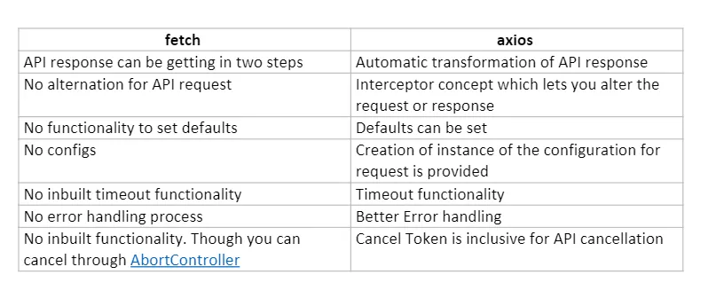
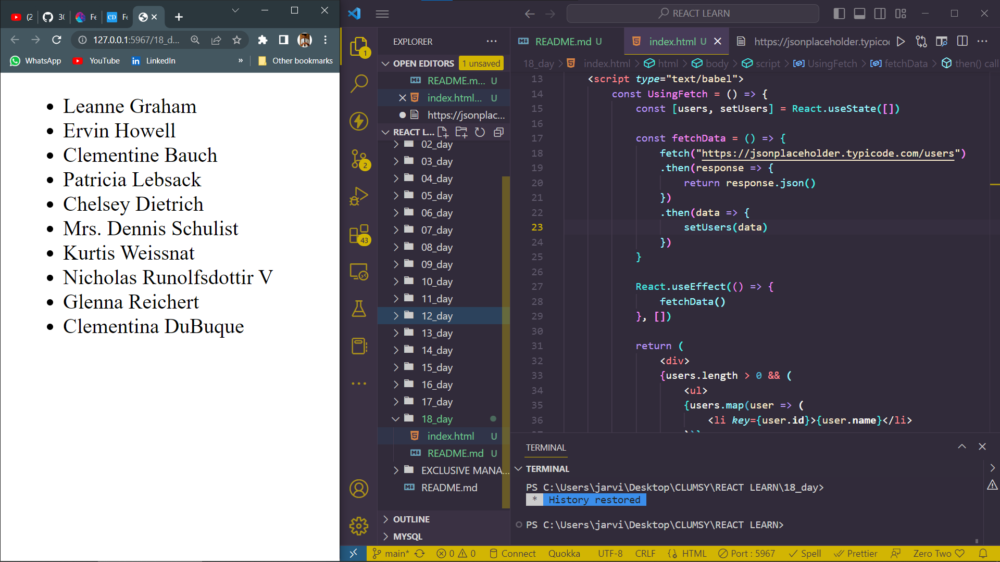

# DAY_18
# Date 13 July 2023 

# Fetch and Axios

## MAJOR DIFFERENCE BETWEEN FETCH AND AXIOS

## What is an API? why do we need them ? 

**API stands for "Application Programming Interface", which is a software intermediary that allows two applications to talk to each other. APIs simplify how developers intergrate new application components into existing architecture, they help business and IT teams collaborate.**

*SYNTAX*
```
fetch("URL")
// The fetch() method returns a Promise. After the fetch() method, include the Promise method then()
// A Promise is an object representing the eventual completion or failure of an asynchronous operation
// Call the fetch function passing the url of the API as a parameter

   .then(() => {
       // Your code for handling the data you get from the API
   })
   .catch(()=> {
       // This is where you run code if the server returns any errors
   });
```

*`.then `– If the Promise returned is resolved, the function within the then() method is executed. That function contains the code for handling the data received from the API.*

*`.catch` – The API you call using fetch() may be down, or other errors may occur. If this happens, the reject promise will be returned. The catch method is used to handle reject. The code within the catch() will be executed if an error occurs when calling the API of your choice.*

# Fetch API
**Fetch API provides a fetch() method defined on the window object. It uses body property. It means that you don't need to install fetch; it comes with ES6 as a built-in functionality.**


```
<!DOCTYPE html>
<html lang="en">
<head>
    <meta charset="UTF-8">
    <meta name="viewport" content="width=device-width, initial-scale=1.0">
    <script crossorigin src="https://unpkg.com/react@18/umd/react.development.js"></script>
    <script crossorigin src="https://unpkg.com/react-dom@18/umd/react-dom.development.js"></script>
    <script src="https://unpkg.com/@babel/standalone/babel.min.js"></script>
    <title>Document</title>
</head>
<body>
    <div id="app"></div>
    <script type="text/babel">
        const UsingFetch = () => {
            const [users, setUsers] = React.useState([])

            const fetchData = () => {
                fetch("https://jsonplaceholder.typicode.com/users")
                .then(response => {
                    return response.json()
                })
                .then(data => {
                    setUsers(data)
                })
            }

            React.useEffect(() => {
                fetchData()
            }, [])

            return (
                <div>
                {users.length > 0 && (
                    <ul>
                    {users.map(user => (
                        <li key={user.id}>{user.name}</li>
                    ))}
                    </ul>
                )}
                </div>
            )
            }
        const rootElement = ReactDOM.createRoot(document.getElementById('app'))
        rootElement.render(<UsingFetch/>)
    </script>
</body>
</html>
```
*Output*



# USING AXIOS

**Axios is stand-alone third-party package that uses data property. To use it, we need to install the axios package from npm.**

`& npm i axios`

*Axios API code example*

```
   axios.get("URL")
    //handling the response
    .then(() => {
       // the code for handling the data you get from api
      })
      .catch((error) => {
        //for handling the error thrown
        console.log(error);
      });
```

*AXIOS EXAMPLE*
```
<!DOCTYPE html>
<html lang="en">
<head>
    <meta charset="UTF-8">
    <meta name="viewport" content="width=device-width, initial-scale=1.0">
    <script crossorigin src="https://unpkg.com/react@18/umd/react.development.js"></script>
    <script crossorigin src="https://unpkg.com/react-dom@18/umd/react-dom.development.js"></script>
    <script src="https://unpkg.com/@babel/standalone/babel.min.js"></script>
    <title>Document</title>
</head>
<body>
    <div id="app"></div>
    <script type="text/babel">
        const UsingFetch = () => {
            const [users, setUsers] = React.useState([])

            const fetchData = () => {
                axios("https://jsonplaceholder.typicode.com/users")
                .then(response => {
                    return response.json()
                })
                .then(data => {
                    setUsers(data)
                })
            }

            React.useEffect(() => {
                fetchData()
            }, [])

            return (
                <div>
                {users.length > 0 && (
                    <ul>
                    {users.map(user => (
                        <li key={user.id}>{user.name}</li>
                    ))}
                    </ul>
                )}
                </div>
            )
            }
        const rootElement = ReactDOM.createRoot(document.getElementById('app'))
        rootElement.render(<UsingFetch/>)
    </script>
</body>
</html>
```
