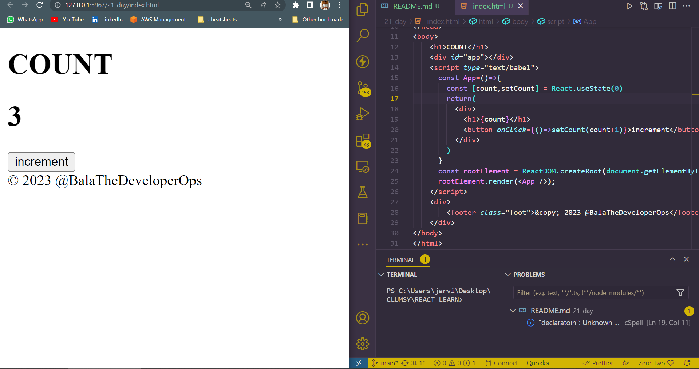
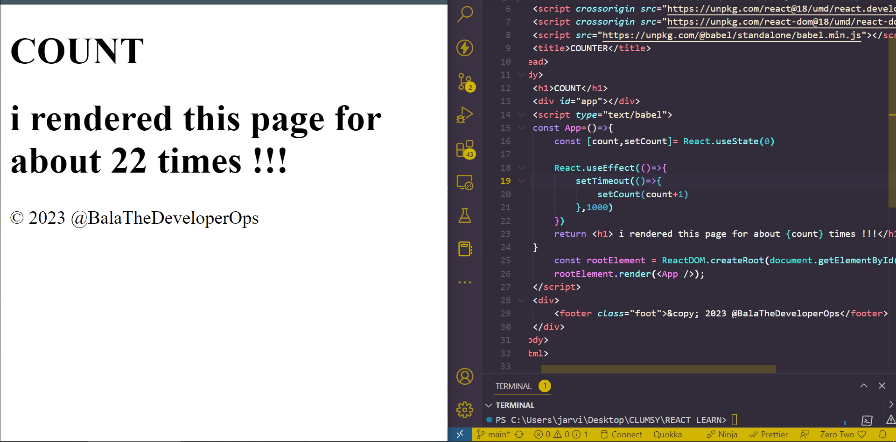
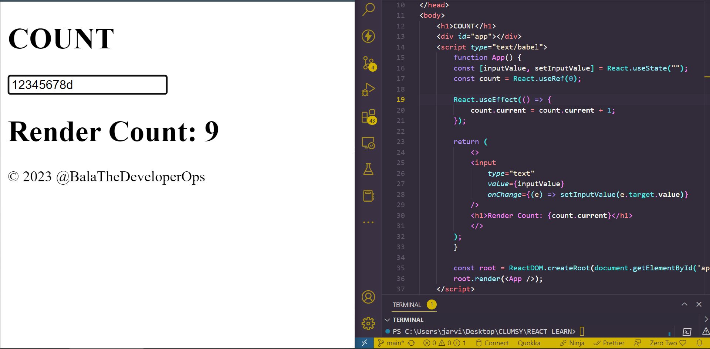
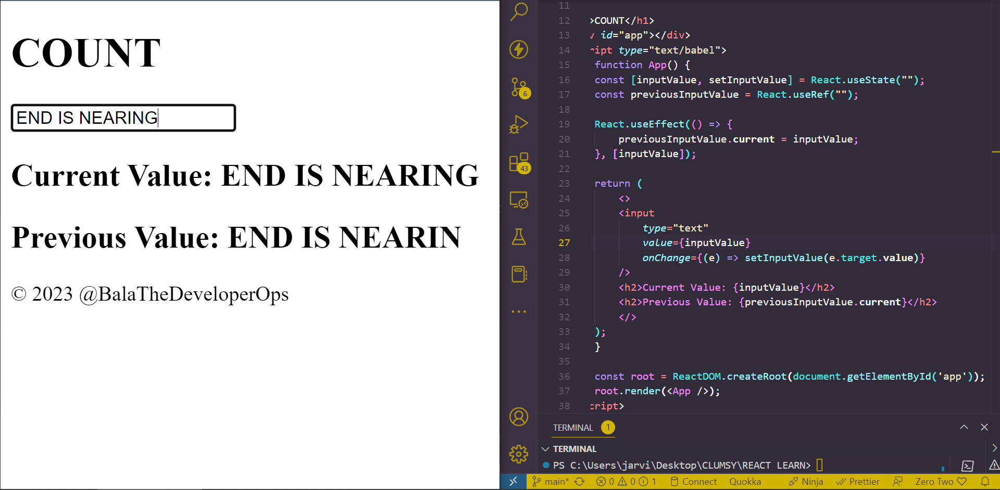

## DAY_21 
## Date 16 July 2023 

# REACT HOOKS 

**Hooks are a new addition in React 16.8. They allow you use state, life cycle methods and other React features without writing a class component. If we are using hooks we can have only a functional component in the entire application.Hooks let you use different React features from your components. You can either use the built-in Hooks or combine them to build your own. This day we see all built-in Hooks in React.**

## There are 3 rules for hooks:
- Hooks can only be called inside React function components.
- Hooks can only be called at the top level of a component.
- Hooks cannot be conditional
## VARIOUS HOOKS
- STATE HOOKS 
- CONTEXT HOOKS 
- REF HOOKS 
- EFFECT HOOKS 
- PERFORMANCE HOOKS 


## STATE HOOKS 
**State lets a component "remember" information like user input. For example, a form component can use state to store the input value, while an image gallery component can use state to store the selected image index. To add state to a component we can use either of these hooks `useState`( declares a state variable that you can update directly) and `useReducer` (declares a state variable with the update logic inside a reducer function)**

*useState declaratoin*
```
function ImageGallery(){
    const [ index,setIndex] = useState(0);
}
```

*Example for useState for increasing the count variable in the page*
```
<!DOCTYPE html>
<html lang="en">
<head>
    <meta charset="UTF-8">
    <meta name="viewport" content="width=device-width, initial-scale=1.0">
    <script crossorigin src="https://unpkg.com/react@18/umd/react.development.js"></script>
    <script crossorigin src="https://unpkg.com/react-dom@18/umd/react-dom.development.js"></script>
    <script src="https://unpkg.com/@babel/standalone/babel.min.js"></script>
    <title>COUNTER</title>
</head>
<body>
    <h1>COUNT</h1>
    <div id="app"></div>
    <script type="text/babel">
      const App=()=>{
        const [count,setCount] = React.useState(0)
        return(
          <div>
            <h1>{count}</h1>
            <button onClick={()=>setCount(count+1)}>increment</button>
          </div>
        )
      }
      const rootElement = ReactDOM.createRoot(document.getElementById('app'));
      rootElement.render(<App />);
    </script>
    <div>
        <footer class="foot">&copy; 2023 @BalaTheDeveloperOps</footer>
    </div>
</body>
</html>

```
*Output of the above*


## EFFECT HOOK
### useEffect 

**The `useEffect` Hook allows you to perform side effects in your components. Some examples of side effect are: fetching data, directly updating the DOM, and timers. `useEffect` accepts two arguments. The second is optional `useEffect(<function>,<dependence>)`**

*Example*
```
<!DOCTYPE html>
<html lang="en">
<head>
    <meta charset="UTF-8">
    <meta name="viewport" content="width=device-width, initial-scale=1.0">
    <script crossorigin src="https://unpkg.com/react@18/umd/react.development.js"></script>
    <script crossorigin src="https://unpkg.com/react-dom@18/umd/react-dom.development.js"></script>
    <script src="https://unpkg.com/@babel/standalone/babel.min.js"></script>
    <title>COUNTER</title>
</head>
<body>
    <h1>COUNT</h1>
    <div id="app"></div>
    <script type="text/babel">
    const App=()=>{
        const [count,setCount]= React.useState(0)

        React.useEffect(()=>{
            setTimeout(()=>{
                setCount(count+1)
            },1000)
        })
        return <h1> i rendered this page for about {count} times !!!</h1>
    }
        const rootElement = ReactDOM.createRoot(document.getElementById('app'));
        rootElement.render(<App />);
    </script>
    <div>
        <footer class="foot">&copy; 2023 @BalaTheDeveloperOps</footer>
    </div>
</body>
</html>

```
*Output of the above*


## Only run on initial render 
```
import { useState, useEffect } from "react";
import ReactDOM from "react-dom/client";

function Timer() {
  const [count, setCount] = useState(0);

  useEffect(() => {
    setTimeout(() => {
      setCount((count) => count + 1);
    }, 1000);
  }, []); // <- add empty brackets here

  return <h1>I've rendered {count} times!</h1>;
}

const root = ReactDOM.createRoot(document.getElementById('root'));
root.render(<Timer />);
```
## useEffect clean up of resources 
```
import { useState, useEffect } from "react";
import ReactDOM from "react-dom/client";

function Timer() {
  const [count, setCount] = useState(0);

  useEffect(() => {
    let timer = setTimeout(() => {
    setCount((count) => count + 1);
  }, 1000);

  return () => clearTimeout(timer)
  }, []);

  return <h1>I've rendered {count} times!</h1>;
}

const root = ReactDOM.createRoot(document.getElementById('root'));
root.render(<Timer />);
```

# useContext Hook 
**React context is a way to manage state globally. It can be used together with the useState hook to share state between deeply nested components more easily that with useState alone.**

# useRef Hooks 
- The useRef hook allows you to persist values between renders.
- It can be used to store a mutable value that does not cause a re-render when updated.
- It can be used to access a DOM element directly. 

```
<!DOCTYPE html>
<html lang="en">
<head>
    <meta charset="UTF-8">
    <meta name="viewport" content="width=device-width, initial-scale=1.0">
    <script crossorigin src="https://unpkg.com/react@18/umd/react.development.js"></script>
    <script crossorigin src="https://unpkg.com/react-dom@18/umd/react-dom.development.js"></script>
    <script src="https://unpkg.com/@babel/standalone/babel.min.js"></script>
    <title>COUNTER</title>
</head>
<body>
    <h1>COUNT</h1>
    <div id="app"></div>
    <script type="text/babel">
        function App() {
        const [inputValue, setInputValue] = React.useState("");
        const count = React.useRef(0);

        React.useEffect(() => {
            count.current = count.current + 1;
        });

        return (
            <>
            <input
                type="text"
                value={inputValue}
                onChange={(e) => setInputValue(e.target.value)}
            />
            <h1>Render Count: {count.current}</h1>
            </>
        );
        }

        const root = ReactDOM.createRoot(document.getElementById('app'));
        root.render(<App />);
    </script>
    <div>
        <footer class="foot">&copy; 2023 @BalaTheDeveloperOps</footer>
    </div>
</body>
</html>

```



## Tracking changes in DOM elements. 
```
<!DOCTYPE html>
<html lang="en">
<head>
    <meta charset="UTF-8">
    <meta name="viewport" content="width=device-width, initial-scale=1.0">
    <script crossorigin src="https://unpkg.com/react@18/umd/react.development.js"></script>
    <script crossorigin src="https://unpkg.com/react-dom@18/umd/react-dom.development.js"></script>
    <script src="https://unpkg.com/@babel/standalone/babel.min.js"></script>
    <title>COUNTER</title>
</head>
<body>
    <h1>COUNT</h1>
    <div id="app"></div>
    <script type="text/babel">
        function App() {
        const [inputValue, setInputValue] = React.useState("");
        const previousInputValue = React.useRef("");

        React.useEffect(() => {
            previousInputValue.current = inputValue;
        }, [inputValue]);

        return (
            <>
            <input
                type="text"
                value={inputValue}
                onChange={(e) => setInputValue(e.target.value)}
            />
            <h2>Current Value: {inputValue}</h2>
            <h2>Previous Value: {previousInputValue.current}</h2>
            </>
        );
        }

        const root = ReactDOM.createRoot(document.getElementById('app'));
        root.render(<App />);
    </script>
    <div>
        <footer class="foot">&copy; 2023 @BalaTheDeveloperOps</footer>
    </div>
</body>
</html>

```
