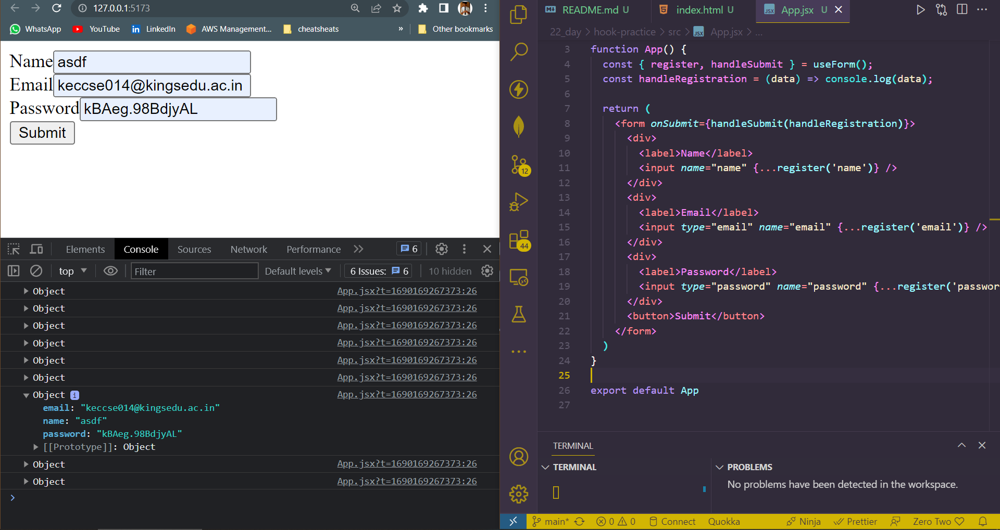
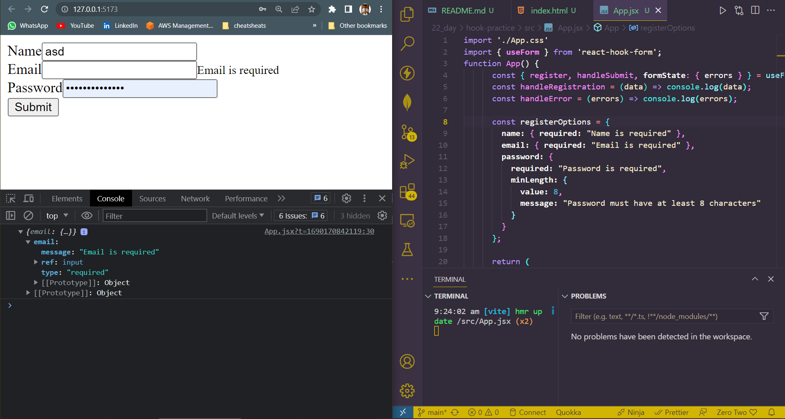

## DAY_22
## Date 23 July 2023 

# REACT FORMS USING HOOKS  

**React Hook form takes a slightly different approach than other form libraries in the REACT ECOSYSTEM by adopting the use of uncontrolled inputs using `ref` instead of depending on the state to control the inputs. This approach makes the forms more performant and reduces the number of re-renders**

*Command to install*
`npm install react-hook-form`

## React Hook Form in Action

`import {useForm} from "react-hook-form" `

**and inside of your component, use the hook as follows:**

` const {register,handleSubmit} = useForm(); `

**The `useForm` Hook returns an object containing a few properties. For now, you only require register and handleSubmit**

*code*
```
import './App.css'
import { useForm } from 'react-hook-form';
function App() {
  const { register, handleSubmit } = useForm();
  const handleRegistration = (data) => console.log(data);

  return (
    <form onSubmit={handleSubmit(handleRegistration)}>
      <div>
        <label>Name</label>
        <input name="name" {...register('name')} />
      </div>
      <div>
        <label>Email</label>
        <input type="email" name="email" {...register('email')} />
      </div>
      <div>
        <label>Password</label>
        <input type="password" name="password" {...register('password')} />
      </div>
      <button>Submit</button>
    </form>
  )
}

export default App

```

*Output*


## VALIDATING FORMS WITH REACT 
**To apply validations to a field, you can pass validation parameters to the register method. Validation parameters are similar to the existing HTML form validation standard.**

**These validation parameters include the following properties :**

- `required` indicates if the field is required or not. If this property is set to `true`, then the field cannot be empty.
- `minlength` and `maxlength` set the minimum and maximum length for a string input value.
- min and max set the minimum and maximum values for a numerical value.
- `type` indicates the type of the input field; it can be email, number, text, or any other standard HTML input types.
- `pattern` defines a pattern for input value using a regular expression. 

*to mark a field `required`, we should initiate it like this*
` <input name="name" type="text" {...register('name', { required: true } )} /> `


## code for validation
```
import './App.css'
import { useForm } from 'react-hook-form';
function App() {
      const { register, handleSubmit, formState: { errors } } = useForm();
      const handleRegistration = (data) => console.log(data);
      const handleError = (errors) => console.log(errors);

      const registerOptions = {
        name: { required: "Name is required" },
        email: { required: "Email is required" },
        password: {
          required: "Password is required",
          minLength: {
            value: 8,
            message: "Password must have at least 8 characters"
          }
        }
      };

      return (
        <form onSubmit={handleSubmit(handleRegistration, handleError)}>
          <div>
            <label>Name</label>
            <input name="name" type="text" {...register('name', registerOptions.name) }/>
            <small className="text-danger">
              {errors?.name && errors.name.message}
            </small>
          </div>
          <div>
            <label>Email</label>
            <input
              type="email"
              name="email"
              {...register('email', registerOptions.email)}
            />
            <small className="text-danger">
              {errors?.email && errors.email.message}
            </small>
          </div>
          <div>
            <label>Password</label>
            <input
              type="password"
              name="password"
              {...register('password', registerOptions.password)}
            />
            <small className="text-danger">
              {errors?.password && errors.password.message}
            </small>
          </div>
          <button>Submit</button>
        </form>
      );
    }

export default App

```
*Output*
