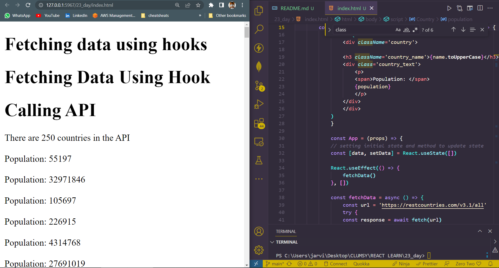

## DAY_22
## Date 21 July 2023 

# Fetching Data Using Hooks  

**Previously I learnt how to fetch data using fetch and axios. In this section, we will use the `useEffect` hook to fetch data. We can use fetch or axios but I prefer to use axios. In React hooks, you don't have to use `componentDidMount` life cycle separately to fetch data.**


## Fetching data in action. 
```
<!DOCTYPE html>
<html lang="en">
<head>
    <meta charset="UTF-8">
    <meta name="viewport" content="width=device-width, initial-scale=1.0">
    <script crossorigin src="https://unpkg.com/react@18/umd/react.development.js"></script>
    <script crossorigin src="https://unpkg.com/react-dom@18/umd/react-dom.development.js"></script>
    <script src="https://cdn.jsdelivr.net/npm/@babel/standalone@7.15.8/babel.min.js"></script>
    <title>Data fetching using hooks</title>
</head>
<body>
    <h1>Fetching data using hooks</h1>
    <div id="app"></div>
    <script type="text/babel">
        const Country = ({ country: { name,flag,population} }) => {
            return (
                <div className='country'>

                <h3 className='country_name'>{name.toUpperCase}</h3>
                <div class='country_text'>
                    <p>
                    <span>Population: </span>
                    {population}
                    </p>
                </div>
                </div>
            )
            }

            const App = (props) => {
            // setting initial state and method to update state
            const [data, setData] = React.useState([])

            React.useEffect(() => {
                fetchData()
            }, [])

            const fetchData = async () => {
                const url = 'https://restcountries.com/v3.1/all'
                try {
                const response = await fetch(url)
                const data = await response.json()
                setData(data)
                } catch (error) {
                console.log(error)
                }
            }

            return (
                <div className='App'>
                    <h1>Fetching Data Using Hook</h1>
                    <h1>Calling API</h1>
                    <div>
                    <p>There are {data.length} countries in the API</p>
                    <div className='countries-wrapper'>
                        {data.map((country, index) => (
                        <Country key={index} country={country} />
                        ))}
                    </div>
                    </div>
                </div>
                )
            }
        const rootElement = ReactDOM.createRoot(document.getElementById('app'))
        rootElement.render(<App />)
    </script>
    <div>
        <footer class="foot">&copy; 2023 @BalaTheDeveloperOps</footer>
    </div>
</body>
</html>

```
