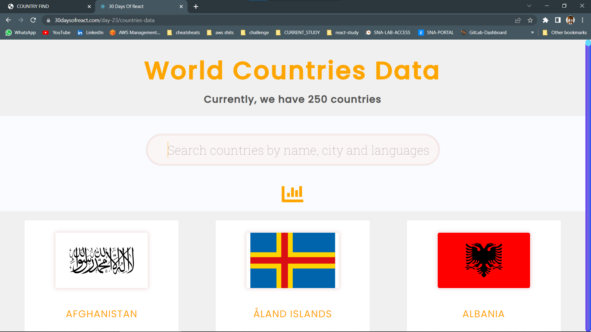
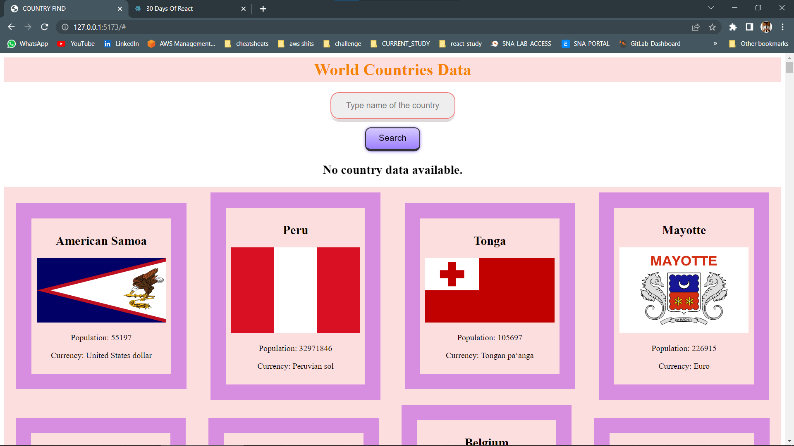
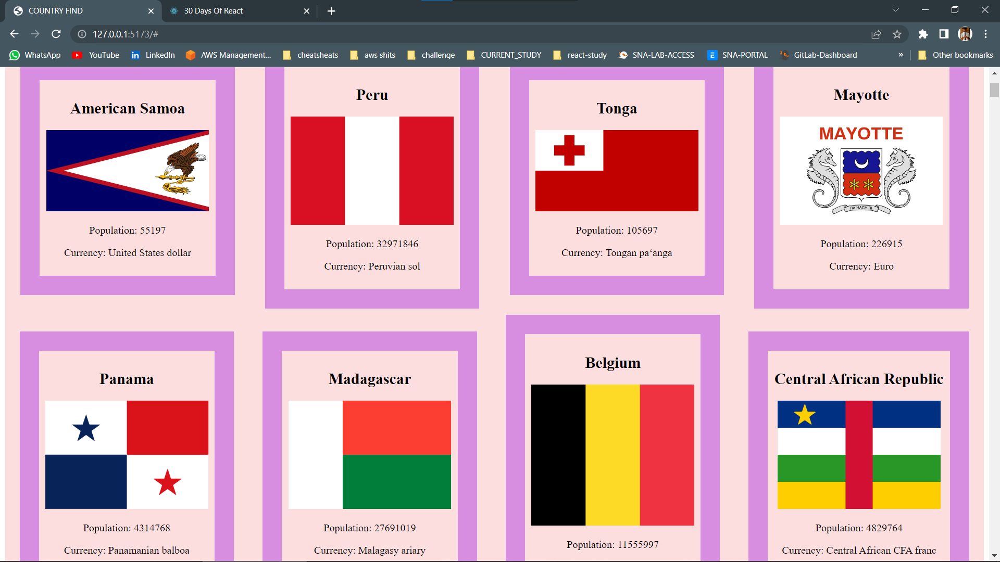
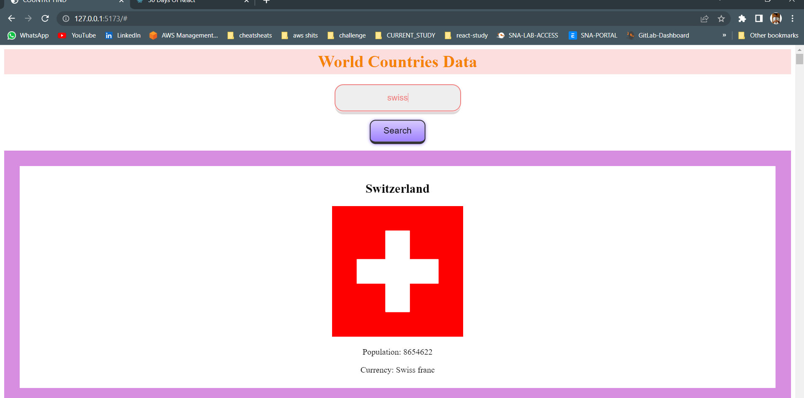
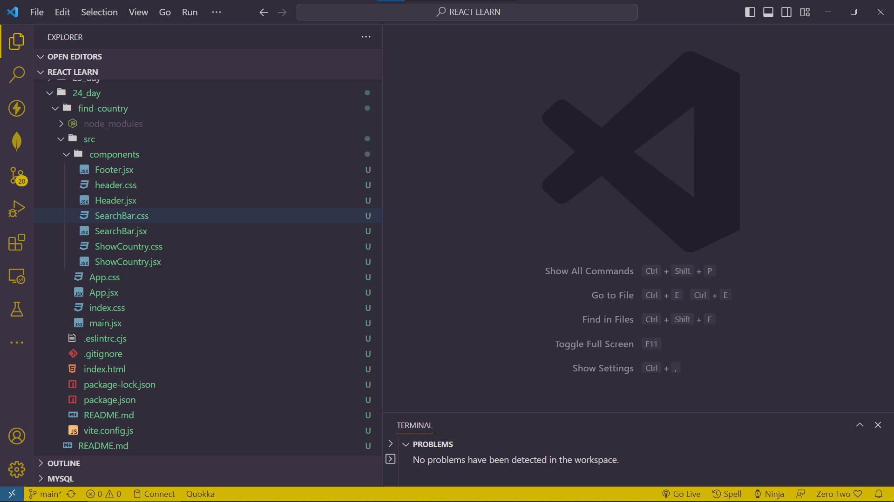

## DAY_24
## Date 26 July 2023 
# Project Using React Hooks
# COUNTRY SEARCHING APPLICATION USING COUNTRY API

## 1. BUILD THE BELOW PROJECT


## Component wise code of my project 

### Header.jsx
```
import './header.css';
const Header = () => {
  return (
    <div className='header-wrapper'>
        <h1>World Countries Data </h1>
    </div>
  )
}

export default Header
```

### SearchBar.jsx
```
import  { useState } from 'react';
import './SearchBar.css'

function SearchBar() {
  const [searchTerm, setSearchTerm] = useState('');
  const [countryData, setCountryData] = useState(null);

  function handleSearch(event) {
    event.preventDefault();
    fetch(`https://restcountries.com/v3.1/name/${searchTerm}`)
      .then(response => response.json())
      .then(data => {
        if (data && Array.isArray(data) && data.length > 0) {
          setCountryData(data[0]);
        } else {
          setCountryData(null);
        }
      })
      .catch(error => console.log(error));
  }

  return (
    <div className='input-wrapper'>
      <form onSubmit={handleSearch}>
        <label>
          <center><input type="text"  placeholder='Type name of the country' value={searchTerm} onChange={event => setSearchTerm(event.target.value)} /></center>
        </label>
        <center><button type="submit" className='btn'>Search</button></center>
      </form>
      {countryData ? (
        <div className='content'>
          <h2>{countryData.name.common}</h2>
          
          <p>Population: {countryData.population}</p>
          {countryData.currencies && Object.values(countryData.currencies)[0] && (
            <p>Currency: {Object.values(countryData.currencies)[0].name}</p>
          )}
        </div>
      ) : (
        <center><h2>No country data available.</h2></center>
      )}
    </div>
  );
}

export default SearchBar;
```


### ShowCountry.jsx
```
import  { useState, useEffect } from 'react';
import './ShowCountry.css'
function ShowCountry() {
  const [countryData, setCountryData] = useState([]);

  useEffect(() => {
    fetch('https://restcountries.com/v3.1/all/')
      .then(response => {
        if (!response.ok) {
          throw new Error('Network response was not ok');
        }
        return response.json();
      })
      .then(data => {
        if (data && Array.isArray(data)) {
          setCountryData(data);
        } else {
          throw new Error('Data is not in the expected format');
        }
      })
      .catch(error => {
        console.log(error);
        setCountryData([]);
      });
  }, []);

  return (
    <div className='content-container'>
      {countryData && countryData.length > 0 ? (
        countryData.map(country => (
          <div key={country.name.common} className='content'>
            <h2>{country.name.common}</h2>
            
            <p>Population: {country.population}</p>
            {country.currencies && Object.values(country.currencies)[0] && (
              <p>Currency: {Object.values(country.currencies)[0].name}</p>
            )}
          </div>
        ))
      ) : (
        <p>No country data available.</p>
      )}
    </div>
  );
}

export default ShowCountry;
```
### Output of the above



# Folder Structure for the Project
