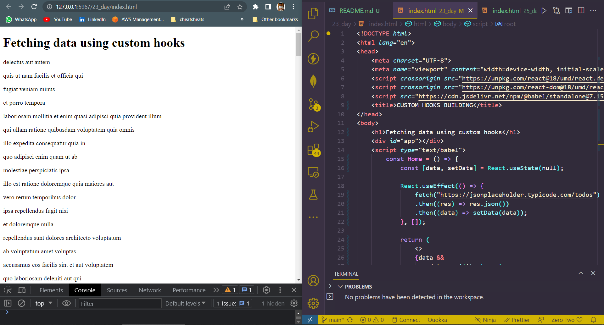
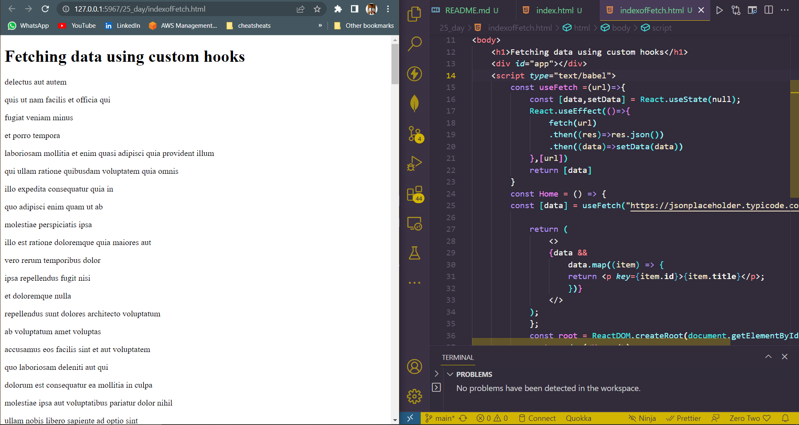

## DAY_25
## Date 27 July 2023 

# REACT CUSTOM HOOKS

**Hooks are reusable functions. When you have component logic that needs to be used by multiple components, we can extract that logic to a custom Hook.**

*Custom Hook start with "use". For example `useFetch`*

## Building a Hook
**We will use the JSONPlaceholder service to fetch face data. This service is great for testing application when there is no existing data.**

### Example
```
<!DOCTYPE html>
<html lang="en">
<head>
    <meta charset="UTF-8">
    <meta name="viewport" content="width=device-width, initial-scale=1.0">
    <script crossorigin src="https://unpkg.com/react@18/umd/react.development.js"></script>
    <script crossorigin src="https://unpkg.com/react-dom@18/umd/react-dom.development.js"></script>
    <script src="https://cdn.jsdelivr.net/npm/@babel/standalone@7.15.8/babel.min.js"></script>
    <title>CUSTOM HOOKS BUILDING</title>
</head>
<body>
    <h1>Fetching data using custom hooks</h1>
    <div id="app"></div>
    <script type="text/babel">
        const Home = () => {
            const [data, setData] = React.useState(null);

            React.useEffect(() => {
                fetch("https://jsonplaceholder.typicode.com/todos")
                .then((res) => res.json())
                .then((data) => setData(data));
            }, []);

            return (
                <>
                {data &&
                    data.map((item) => {
                    return <p key={item.id}>{item.title}</p>;
                    })}
                </>
            );
            };

            const root = ReactDOM.createRoot(document.getElementById('app'));
            root.render(<Home />);
    </script>
    <div>
        <footer class="foot">&copy; 2023 @BalaTheDeveloperOps</footer>
    </div>
</body>
</html>

```


## Now splitting files with custom hook file and index file.
### indexOfFetch.html
```
<!DOCTYPE html>
<html lang="en">
<head>
    <meta charset="UTF-8">
    <meta name="viewport" content="width=device-width, initial-scale=1.0">
    <script crossorigin src="https://unpkg.com/react@18/umd/react.development.js"></script>
    <script crossorigin src="https://unpkg.com/react-dom@18/umd/react-dom.development.js"></script>
    <script src="https://cdn.jsdelivr.net/npm/@babel/standalone@7.15.8/babel.min.js"></script>
    <title>CUSTOM HOOKS BUILDING</title>
</head>
<body>
    <h1>Fetching data using custom hooks</h1>
    <div id="app"></div>
    <script type="text/babel">
        const useFetch =(url)=>{
            const [data,setData] = React.useState(null);
            React.useEffect(()=>{
                fetch(url)
                .then((res)=>res.json())
                .then((data)=>setData(data))
            },[url])
            return [data]
        }
        const Home = () => {
        const [data] = useFetch("https://jsonplaceholder.typicode.com/todos");

            return (
                <>
                {data &&
                    data.map((item) => {
                    return <p key={item.id}>{item.title}</p>;
                    })}
                </>
            );
            };
            const root = ReactDOM.createRoot(document.getElementById('app'));
            root.render(<Home />);
    </script>
    <div>
        <footer class="foot">&copy; 2023 @BalaTheDeveloperOps</footer>
    </div>
</body>
</html>

```



**The useState and useEffect hooks are most common React hooks which you use on daily bases. In addition to the basic hook, there are additional hooks which are not used often. You do not have to know how to use all the hooks. The useState, useEffect and useRef are very important hooks and it is recommended to know how to use them.**

**All I did is that making a custom method with a useState and useEffect inside to update and retrieve data from API source and calling this method from outside of components. The main use of this custom hook is that any number of component can call is anytime.**