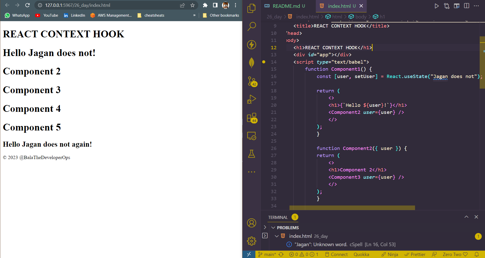
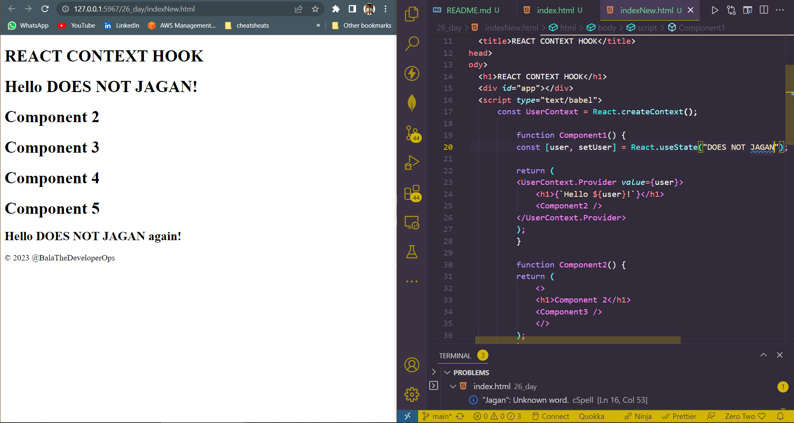

## DAY_26
## Date 27 July 2023 

# React useContext Hook

**React Context is a way to manage state globally. It can be used together with the `useState` hook to share state between deeply nested components more easily than with `useState` alone.**

## Problem 
**State should be held by the highest parent component in the stack that requires access to the state. To illustrate, we have many nested components. The component at the top and bottom of the stack need access to the state. To do this without Context, we will need to pass the state as "props" through each nested component. This is call "prop drilling".**

*CODE*
```
<!DOCTYPE html>
<html lang="en">
<head>
    <meta charset="UTF-8">
    <meta name="viewport" content="width=device-width, initial-scale=1.0">
    <script crossorigin src="https://unpkg.com/react@18/umd/react.development.js"></script>
    <script crossorigin src="https://unpkg.com/react-dom@18/umd/react-dom.development.js"></script>
    <script src="https://cdn.jsdelivr.net/npm/@babel/standalone@7.15.8/babel.min.js"></script>
    <title>REACT CONTEXT HOOK</title>
</head>
<body>
    <h1>REACT CONTEXT HOOK</h1>
    <div id="app"></div>
    <script type="text/babel">
        function Component1() {
            const [user, setUser] = React.useState("Jagan does not");

            return (
                <>
                <h1>{`Hello ${user}!`}</h1>
                <Component2 user={user} />
                </>
            );
            }

            function Component2({ user }) {
            return (
                <>
                <h1>Component 2</h1>
                <Component3 user={user} />
                </>
            );
            }

            function Component3({ user }) {
            return (
                <>
                <h1>Component 3</h1>
                <Component4 user={user} />
                </>
            );
            }

            function Component4({ user }) {
            return (
                <>
                <h1>Component 4</h1>
                <Component5 user={user} />
                </>
            );
            }

            function Component5({ user }) {
            return (
                <>
                <h1>Component 5</h1>
                <h2>{`Hello ${user} again!`}</h2>
                </>
            );
            }

            const root = ReactDOM.createRoot(document.getElementById('app'));
            root.render(<Component1 />);
    </script>
    <div>
        <footer class="foot">&copy; 2023 @BalaTheDeveloperOps</footer>
    </div>
</body>
</html>

```

*output of the above*


**// Even though the components 2-4 did not need the state, they had to pass the state along so that it could reach component5.**

## Solution
**To create context is the solution. In order to create it, we must Import `createContext` and initialize it.**

```
import {useState,createContext} from "react";
import ReactDOM from "react-dom/client";

const UserContext = createContext();
```
**Next we will use the context provider to wrap the tree of components that need the state context.**

## CONTEXT PROVIDER

**Wrap child component in the context provider and supply state value.**
```
    function Component1() {
    const [user, setUser] = useState("Jesse Hall");

    return (
        <UserContext.Provider value={user}>
        <h1>{`Hello ${user}!`}</h1>
        <Component2 user={user} />
        </UserContext.Provider>
    );
    }
```
*Now, all components in this tree will have access to the user Context.*

## Use the `useContext` Hook
**In order to use the context in a child component, we need to access it using the `useContext` hook. First, include the `useContext` in the import statement.**

`import {useState,createContext,useContext} from 'react';` 

## Full example on how to use useContext hook in react

```
<!DOCTYPE html>
<html lang="en">
<head>
    <meta charset="UTF-8">
    <meta name="viewport" content="width=device-width, initial-scale=1.0">
    <script crossorigin src="https://unpkg.com/react@18/umd/react.development.js"></script>
    <script crossorigin src="https://unpkg.com/react-dom@18/umd/react-dom.development.js"></script>
    <script crossorigin src="https://unpkg.com/react@18/umd/react.development.js"></script>
<script crossorigin src="https://unpkg.com/react-dom@18/umd/react-dom.development.js"></script>
    <script src="https://cdn.jsdelivr.net/npm/@babel/standalone@7.15.8/babel.min.js"></script>
    <title>REACT CONTEXT HOOK</title>
</head>
<body>
    <h1>REACT CONTEXT HOOK</h1>
    <div id="app"></div>
    <script type="text/babel">
        const UserContext = React.createContext();

            function Component1() {
            const [user, setUser] = React.useState("DOES NOT JAGAN");

            return (
            <UserContext.Provider value={user}>
                <h1>{`Hello ${user}!`}</h1>
                <Component2 />
            </UserContext.Provider>
            );
            }

            function Component2() {
            return (
                <>
                <h1>Component 2</h1>
                <Component3 />
                </>
            );
            }

            function Component3() {
            return (
                <>
                <h1>Component 3</h1>
                <Component4 />
                </>
            );
            }

            function Component4() {
            return (
                <>
                <h1>Component 4</h1>
                <Component5 />
                </>
            );
            }

            function Component5() {
            const user = React.useContext(UserContext);

            return (
                <>
                <h1>Component 5</h1>
                <h2>{`Hello ${user} again!`}</h2>
                </>
            );
            }

            const root = ReactDOM.createRoot(document.getElementById('app'));
            root.render(<Component1 />);
    </script>
    <div>
        <footer class="foot">&copy; 2023 @BalaTheDeveloperOps</footer>
    </div>
</body>
</html>

```


**What we did is that, passing the state value to the child most component without passing it unnecessarily to the middle components saving dom feature.**