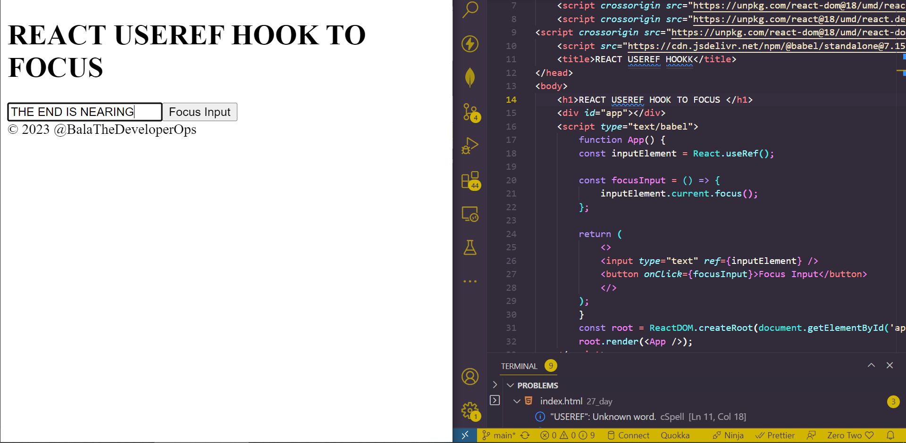

## DAY_27
## Date 28 July 2023 

# React useRef Hook
**The `useRef` hook allows you to persist values between renders. It can be used to store a mutable value that does not cause a re-renders when updated. It can be used to access a DOM element directly.**

**The useRef returns a mutable ref object whose .current property is initialized to the passed argument (initialValue). The returned object will persist for the full lifetime of the component.**

*Code*
```
<!DOCTYPE html>
<html lang="en">
<head>
    <meta charset="UTF-8">
    <meta name="viewport" content="width=device-width, initial-scale=1.0">
    <script crossorigin src="https://unpkg.com/react@18/umd/react.development.js"></script>
    <script crossorigin src="https://unpkg.com/react-dom@18/umd/react-dom.development.js"></script>
    <script crossorigin src="https://unpkg.com/react@18/umd/react.development.js"></script>
<script crossorigin src="https://unpkg.com/react-dom@18/umd/react-dom.development.js"></script>
    <script src="https://cdn.jsdelivr.net/npm/@babel/standalone@7.15.8/babel.min.js"></script>
    <title>REACT USEREF HOOKK</title>
</head>
<body>
    <h1>REACT USEREF HOOK</h1>
    <div id="app"></div>
    <script type="text/babel">
        const App=()=>{
            const [inputValue,setInputValue]=React.useState("")
            const count = React.useRef(0)
            React.useEffect(()=>{
                count.current = count.current+1
            })
            return(
                <>
                <input type="text" value={inputValue} onChange={(e)=>setInputValue(e.target.value)}/>
                <h1> Render count : {count.current}</h1>
                </>
            )
        }        
        const root = ReactDOM.createRoot(document.getElementById('app'));
        root.render(<App />);
    </script>
    <div>
        <footer class="foot">&copy; 2023 @BalaTheDeveloperOps</footer>
    </div>
</body>
</html>

```
*Output of the above*


- `useRef()` only return one item. It returns an Object called `current`.
- When we initialize `useRef` we set the initial value: `useRef(0)`
- It will look like this: `const count = {current:0}`. We can access the count value by using `count.current`


## ACCESSING DOM ELEMENTS
```
<!DOCTYPE html>
<html lang="en">
<head>
    <meta charset="UTF-8">
    <meta name="viewport" content="width=device-width, initial-scale=1.0">
    <script crossorigin src="https://unpkg.com/react@18/umd/react.development.js"></script>
    <script crossorigin src="https://unpkg.com/react-dom@18/umd/react-dom.development.js"></script>
    <script crossorigin src="https://unpkg.com/react@18/umd/react.development.js"></script>
<script crossorigin src="https://unpkg.com/react-dom@18/umd/react-dom.development.js"></script>
    <script src="https://cdn.jsdelivr.net/npm/@babel/standalone@7.15.8/babel.min.js"></script>
    <title>REACT USEREF HOOKK</title>
</head>
<body>
    <h1>REACT USEREF HOOK TO FOCUS </h1>
    <div id="app"></div>
    <script type="text/babel">
        function App() {
        const inputElement = React.useRef();

        const focusInput = () => {
            inputElement.current.focus();
        };

        return (
            <>
            <input type="text" ref={inputElement} />
            <button onClick={focusInput}>Focus Input</button>
            </>
        );
        }        
        const root = ReactDOM.createRoot(document.getElementById('app'));
        root.render(<App />);
    </script>
    <div>
        <footer class="foot">&copy; 2023 @BalaTheDeveloperOps</footer>
    </div>
</body>
</html>

```
*Output of the above*


## TRACKING STATE CHANGES 

- tHE `useRef` hook can also be used to keep track of previous state values. 
- This is because we are able to persist `useRef` values between renders.

*CODE*
```
<!DOCTYPE html>
<html lang="en">
<head>
    <meta charset="UTF-8">
    <meta name="viewport" content="width=device-width, initial-scale=1.0">
    <script crossorigin src="https://unpkg.com/react@18/umd/react.development.js"></script>
    <script crossorigin src="https://unpkg.com/react-dom@18/umd/react-dom.development.js"></script>
    <script crossorigin src="https://unpkg.com/react@18/umd/react.development.js"></script>
<script crossorigin src="https://unpkg.com/react-dom@18/umd/react-dom.development.js"></script>
    <script src="https://cdn.jsdelivr.net/npm/@babel/standalone@7.15.8/babel.min.js"></script>
    <title>REACT USEREF HOOKK</title>
</head>
<body>
    <h1>REACT USEREF HOOK TO TRACK STATE CHANGE</h1>
    <div id="app"></div>
    <script type="text/babel">
        function App() {
                const [inputValue, setInputValue] = React.useState("");
                const previousInputValue = React.useRef("");

                React.useEffect(() => {
                    previousInputValue.current = inputValue;
                }, [inputValue]);

                return (
                    <>
                    <input
                        type="text"
                        value={inputValue}
                        onChange={(e) => setInputValue(e.target.value)}
                    />
                    <h2>Current Value: {inputValue}</h2>
                    <h2>Previous Value: {previousInputValue.current}</h2>
                    </>
                );
                }       
        const root = ReactDOM.createRoot(document.getElementById('app'));
        root.render(<App />);
    </script>
    <div>
        <footer class="foot">&copy; 2023 @BalaTheDeveloperOps</footer>
    </div>
</body>
</html>

```

*OUTPUT OF THE ABOVE*
