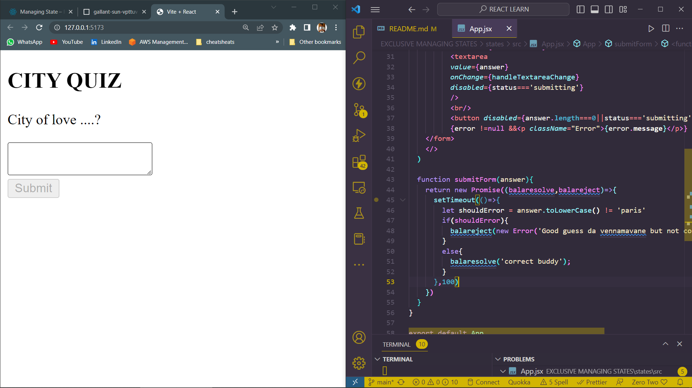

# MANAGING STATES 

## As our application grows, it helps to be more intentional about how our state is organized and how the data flows between our components. Redundant or duplicate state is a common source of bugs. Here will see how to structure our state well, how to keep our state update logic maintainable, and how to share state between distant components. 

```
import { useState } from "react"

function App() {
  const [answer,setAnswer] = useState('');
  const [error,setError] = useState(null);
  const [status,setStatus]=useState('typing');
  
  if(status==='success'){
    return <h1>you are right</h1>
  }

  async function handleSubmit(e){
    e.preventDefault();
    setStatus('submitting')
    try{
      await submitForm(answer)
      setStatus('success')
    }catch (error){
        setStatus('typing')
        setError(error)
    }
  }
  function handleTextareaChange(e){
    setAnswer(e.target.value);
  }
  return(
    <>
    <h2>CITY QUIZ</h2>
    <p>City of love ....?</p>
    <form onSubmit={handleSubmit}>
          <textarea
          value={answer}
          onChange={handleTextareaChange}
          disabled={status==='submitting'}
          />
          <br/>
          <button disabled={answer.length===0||status==='submitting'}>Submit</button>
          {error !=null &&<p className="Error">{error.message}</p>}
    </form>
    </>
  )

  function submitForm(answer){
    return new Promise((balaresolve,balareject)=>{
      setTimeout(()=>{
        let shouldError = answer.toLowerCase() != 'paris'
        if(shouldError){
          balareject(new Error('Good guess da vennamavane but not correct, try again!!!'))
        }
        else{
          balaresolve('correct buddy');
        }
      },100)
    })
  }
}

export default App

```

*OUTPUT OF THE FOLLOWING*
