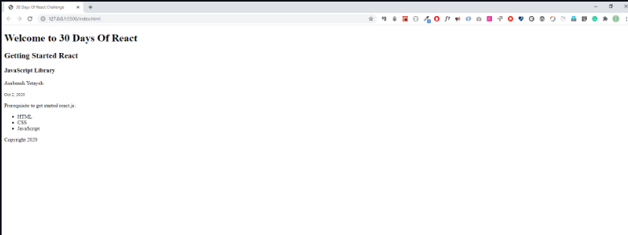
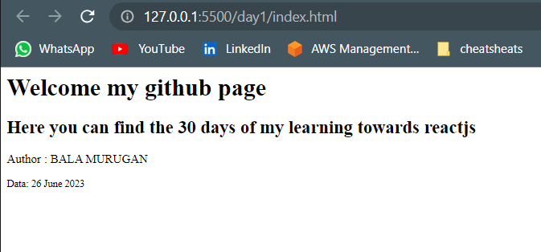
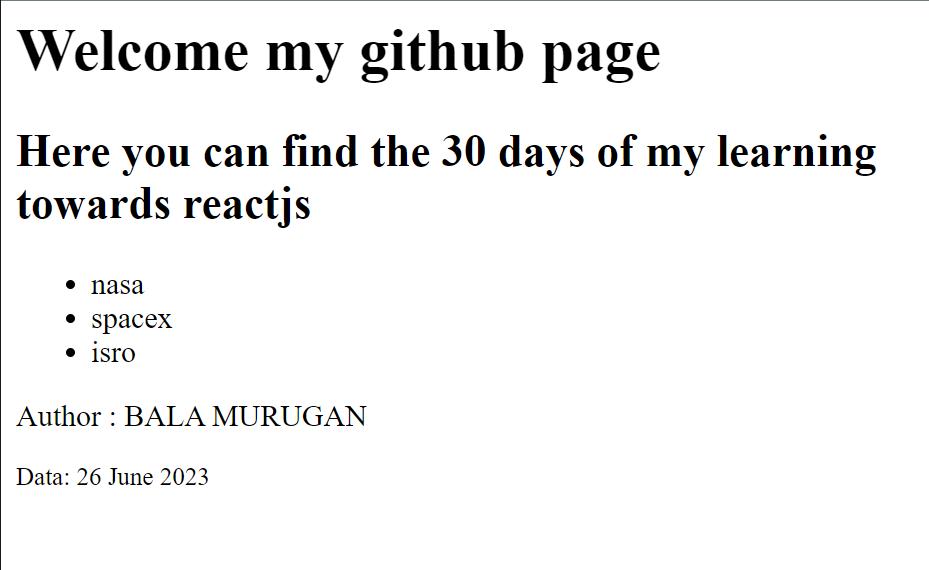
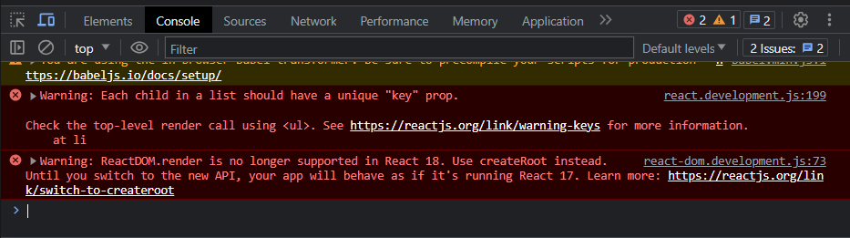

# DAY_1
# ABOUT REACT JS , ES6 and BABEL 
**React is a JavaScript library for building a reusable user interface(UI). It was initially released on May 29, 2013. The current version is 16.13.1 and somehow it is stable. React was created by Facebook. React makes creating UI components very easy. The official React documentation can be found here. When we work with React we do not interact directly with the DOM. React has its own way to handle the DOM(Document Object Model) manipulation. React uses its virtual DOM to make new changes and it updates only the element, that needs changing. Do not directly interact with DOM when you build a React Application and leave the DOM manipulation job for the React virtual DOM. In this challenge, we will develop 10-15 web applications using React. A web application, or a website, is made of buttons, links, forms with different input fields, header, footer, sections, articles, texts, images, audios, videos and boxes with different shapes. We use react to make a reusable UI components of a website.**

## In short 

1. React was released in May 2013
2. React was created by Facebook
3. React is a JavaScript library for building user interfaces
4. React is used to build single page applications - An application which has only one HTML page.
5. React allows us to create reusable UI components
6. React latest release is 18
7. React versions(https://legacy.reactjs.org/versions/)
8. React official documentation can be found here(https://legacy.reactjs.org/docs/getting-started.html)
---------------------------------------------------------------------------------------------------------------------------------

# JSX JAVASCRIPT XML 

**JSX stands for JavaScript XML. JSX allows us to write HTML elements with JavaScript code. An HTML element has an opening and closing tags, content, and attribute in the opening tag. However, some HTML elements may not have content and a closing tag - they are self closing elements. To create HTML elements in React we do not use the createElement() instead we just use JSX elements. Therefore, JSX makes it easier to write and add HTML elements in React. JSX will be converted to JavaScript on browser using a transpiler - babel.js. Babel is a library which transpiles JSX to pure JavaScript and latest JavaScript to older version. See the JSX code below.**

``` 
// JSX syntax
// we don't need to use quotes with JSX

const jsxElement = <h1>I am a JSX element</h1>
const welcome = <h1>Welcome to 30 Days of React Challenge</h1>
const data = <small>Oct 2, 2020</small> 
```

## As you can see the above code consists of JSX declaration of some tags in html##

**RENDERING JSX ELEMENTS**

``` 
<html>
    <title>HELLO REACT</title>
    <script crossorigin src="https://unpkg.com/react@18/umd/react.development.js"></script>
    <script crossorigin src="https://unpkg.com/react-dom@18/umd/react-dom.development.js"></script>
    <script src="https://unpkg.com/@babel/standalone/babel.min.js"></script>
    <body>
        <div id="app"></div>
        <script type="text/babel">
            const header = (
                <header>
                    <h1> Hi this bala </h1>
                    <h2> Im Learning React </h2>
                    <p> Since I'm out of imaginary words, I'm typing this </p>
                </header>
            )
            ReactDOM.render(<h1>Hello this is bala murugan</h1>,document.querySelector('#app'));
            ReactDOM.render(header,document.querySelector('#app'))
        </script>
    </body>


</html> 
```

**HOW TO RENDER MORE THAN ONE COMPONENT INSIDE THE RENDER FUNCTION**

```
 <!DOCTYPE html>
  <html lang="en">
  <head>
    <meta charset="UTF-8" />
    <meta name="viewport" content="width=device-width, initial-scale=1.0" />
    <title>30 Days Of React Challenge</title>
  </head>

  <body>
    <div class="root"></div>

 <script crossorigin src="https://unpkg.com/react@18/umd/react.development.js"></script>
    <script crossorigin src="https://unpkg.com/react-dom@18/umd/react-dom.development.js"></script>
    <script src="https://unpkg.com/@babel/standalone/babel.min.js"></script>
    <script type="text/babel">
      // To get the root element from the HTML document
      const rootElement = document.querySelector('.root')

      // JSX element, header
      const header = (
        <header>
          <h1>Welcome to 30 Days Of React</h1>
          <h2>Getting Started React</h2>
          <h3>JavaScript Library</h3>
          <p>Asabeneh Yetayeh</p>
          <small>Oct 2, 2020</small>
        </header>
      )

      // JSX element, main
      const main = (
        <main>
          <p>Prerequisite to get started react.js:</p>
          <ul>
            <li>HTML</li>
            <li>CSS</li>
            <li>JavaScript</li>
          </ul>
        </main>
      )

      // JSX element, footer
      const footer = (
        <footer>
          <p>Copyright 2020</p>
        </footer>
      )

      // JSX element, app, a container or a parent
      const app = (
        <div>
          {header}
          {main}
          {footer}
        </div>
      )

      // we render the JSX element using the ReactDOM package
      // ReactDOM has the render method and the render method takes two argument
      ReactDOM.render(app, rootElement)
      // or
      //  ReactDOM.render([header, main, footer], rootElement)
    </script>
  </body>
</html>
```

------------------------------------------------------------------------------------------------------------------------------

**INJECTING DATA INTO JSX**

```
const welcome = 'Welcome my github page'
            const title ='Here you can find the 30 days of my learning towards reactjs'
            const authorName = 'BALA MURUGAN'
            const date ='26 June 2023 '

            const main = (
                <div >
                    <h1>{welcome}</h1>
                    <h2>{title}</h2>
                    <p>
                        Author : {authorName}
                        </p>
                    <small>Data: {date}</small>
                </div>
            )
```

--------------------------------------------------------------------------------------
**THE LIST ITEMS THAT WE SPECIFY WILL BE PASTED AS HORIZONTAL OR IT MAY LOOK CLUMSY**

**SO IN ORDER TO ACHIEVE GOOD PROGRAM, WE HAVE TO FUNCTIONAL PROGRAM IT**

```
const items = ['nasa','spacex','isro'];
const formattedList = items.map((item)=> <li> {item}</li>) ;

const usageInCode = (
    <div>
    // every item returned by the map function will take place inside as list item.
    <ul>{formattedList}</ul>
    </div>
)

```


**NOTE: ERROR OCCURRED THAT IS **

**In order to remove this, we should assign unique key to every child and that's good practice too, because you will have control over your child elements.**

const items = ['nasa','spacex','isro'];
/// we are assigning key as name of the list item itself.
const formattedList = items.map((item)=> <li key={tech}> {item}</li>) ;

const usageInCode = (
    <div>
    // every item returned by the map function will take place inside as list item.
    <ul>{formattedList}</ul>
    </div>
)

```