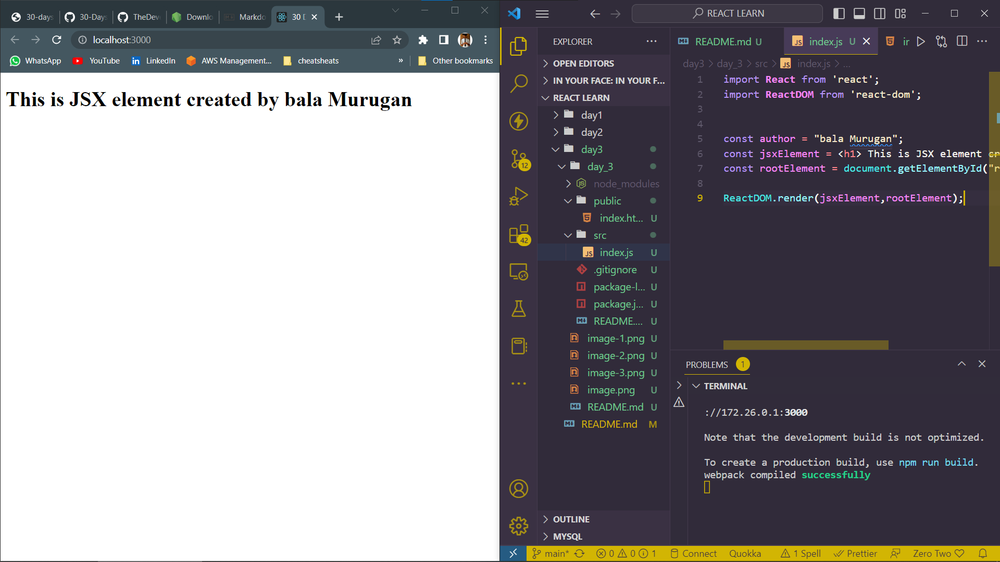

# DAY_3
# Date 28 June 2023 

# Setting Up

**During the practice of day1 and day2 i used to something called CDN termed as CONTENT DELIVERY NETWORK. So in order to create a fully fledged web app with react we are need of node modules.**

#Node 

**Node is a javascript runtime environment that allows javascript to run on the server. Node was created in 2009. Node has played a great role for the growth of javascript. The react application starts by default at localhost 3000. The create-react-app has configured a node server for the React application. That is why we need node and node modules. We wil see create-react-app soon.**

[Download here](https://nodejs.org/en/download)


#Create React App

**Creating a React Base Application from the Create React App**
`npx create-react-app day_3`


*After the Command the node modules are downloaded*


*To run the application*
`npm start`


# React Base App Modules Teardown

## Let's see the React boilerplate, which has been created by create-react-app. Whenever you create a new project, you run create-react-app and name of the project.*

## In the following React boilerplate, there are three folders: node_modules, public and src. In addition, there are .gitignore, README.md, package.json and yarn.lock. Some of you, instead of yarn.lock, you may have package-lock.json.

### It is good to know these folders and files.

1. node_modules - stores all the necessary node packages of the React applications.

2. Public

- index.html - the only HTML file we have in the entire application

- favicon.ico - an icon file

- manifest.json - is used to make the application a progressive web app

- other images - open graph images(open graph images are images which are visible when a link share on social media)

- robots.txt - information, if the website allows web scraping

3. src

- App.css, index.css - are different CSS files
- index.js - a file which allows to connect all the components with index.html
- App.js - A file where we usually import most of the presentational components
- serviceWorker.js: is used to add progressive web app features
- setupTests.js - to write testing cases
- package.json- List of packages the applications uses

- .gitignore - React boilerplate comes with git initiated, and the .gitignore allows files and folders not to be pushed to GitHub

- README.md - Markdown file to write documentation

- yarn.lock or package-lock.json - a means to lock the version of the package

**After removing unwanted base files.Now lets write code on index.js. First of, we should import React and ReactDOM. React allows us to write JSX and ReactDOM to render the JSX on the DOM. ReactDOM has a render method. Let's use all the JSX elements we created on Day 2. The ReactDOM render method takes two parameters, a JSX or a component and the root.**

*index.js*

```
//index.js
// importing the react and react-dom package

import React from 'react'
import ReactDOM from 'react-dom'

const jsxElement = <h1>This is a JSX element</h1>
const rootElement = document.getElementById('root')

ReactDOM.render(jsxElement, rootElement)
```

*index.html*

```
<!-- index.html -->
<!DOCTYPE html>
<html lang="en">
  <head>
    <meta charset="utf-8" />
    <meta name="viewport" content="width=device-width, initial-scale=1" />
    <link
      href="https://fonts.googleapis.com/css?family=Montserrat:300,400,500|Roboto:300,400,500&display=swap"
      rel="stylesheet"
    />
    <meta
      name="description"
      content="Web site created using create-react-app"
    />

    <title>30 Days Of React App</title>
  </head>
  <body>
    <div id="root"></div>
  </body>
</html>
```


# Some more Complex Components

```
*index.js
import React from 'react';
import ReactDOM from 'react-dom';


const title = <h1> 30 Days of React Learning</h1>

const header= (
  <header>
    <h1>Welcome to my page</h1>
    <h2>Let's get started with React</h2>
    <h3> Javascript Library </h3>
    <p>Bala murugan </p>
    <small> June 28, 2023</small>
  </header>
)

const rootElement = document.getElementById('root');
ReactDOM.render(header,rootElement);
```


## Adding the jsx from Day_2

```
import React from 'react';
import ReactDOM from 'react-dom';

// INJECTING DATA INTO JSX ELEMENT 
const welcome = 'Welcome my github page'
const title ='Here you can find the 30 days of my learning towards reactjs'
const authorName = 'BALA MURUGAN'
const date ='26 June 2023 '
const items = ['nasa','spacex','isro'];
const formattedList = items.map((item)=> <li> {item}</li>) ;

const main = (
  <div >
      <h1>{welcome}</h1>
      <h2>{title}</h2>
      <ul>{formattedList}</ul>
      <p>
          Author : {authorName}
          </p>
      <small>Data: {date}</small>
  </div>
)


const rootElement = document.getElementById('root');
ReactDOM.render(main,rootElement);
```

*output*


#Styles in JSX 

*from previous days*
```
// index.js
import React from 'react'
import ReactDOM from 'react-dom'

const headerStyles = {
  backgroundColor: '#61DBFB',
  fontFamily: 'Helvetica Neue',
  padding: 25,
  lineHeight: 1.5,
}

// JSX element, header
const header = (
  <header style={headerStyles}>
    <div className='header-wrapper'>
      <h1>Welcome to 30 Days Of React</h1>
      <h2>Getting Started React</h2>
      <h3>JavaScript Library</h3>
      <p>Asabeneh Yetayeh</p>
      <small>Oct 2, 2020</small>
    </div>
  </header>
)

// JSX element, main
const mainStyles = {
  backgroundColor: '#F3F0F5',
}
const main = (
  <main style={mainStyles}>
    <p>Prerequisite to get started react.js:</p>
    <ul>
      <li>HTML</li>
      <li>CSS</li>
      <li>JavaScript</li>
    </ul>
  </main>
)

const footerStyles = {
  backgroundColor: '#61DBFB',
}
// JSX element, footer
const footer = (
  <footer style={footerStyles}>
    <p>Copyright 2020</p>
  </footer>
)

// JSX element, app
const app = (
  <div className='app'>
    {header}
    {main}
    {footer}
  </div>
)

const rootElement = document.getElementById('root')
// we render the JSX element using the ReactDOM package
ReactDOM.render(app, rootElement)
```

*output*


# Importing Images to out React Application