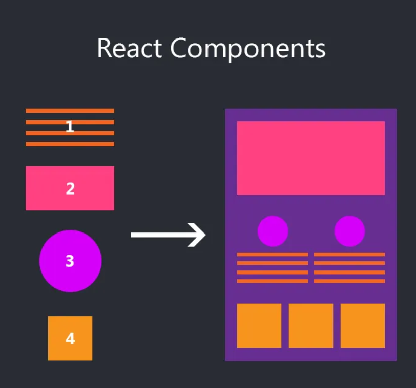
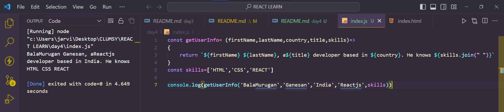

# DAY_4
# Date 29 June 2023 

# React Components in a bigger picture

## COMPONENTS

**A React Component is a small, reusable code, which is responsible for one part of the application UI. A React application is an aggregation of components. React can help us to build reusable components. The following diagram shows different components.**

*Let's see some diagram*



## Types of components 
- Functional component
- Presentational component
- Stateless Components
- Dumb components

- Class Components 
- Container Components
- Statefull Component 
- Smart Component 

## Javascript Function
### Javascript Arrow function(mostly)

```
const getUserInfo= (firstName,lastName,country,title,skills)=>{
    return `${firstName} ${lastName}, a${title} developer based in ${country}. He knows ${skills.join(" )}`
}
const skills=['HTML','CSS','REACT']

console.log(getUserInfo('BalaMurugan','Ganesan','India','Reactjs',skills))

```
*output of the above*


# JAVASCRIPT CLASS
**A class is a blueprint of an object. We instantiate a class to create a different objects. In addition, we can create children, by inheriting all the methods and properties of the parent.**

```
class Parent{
    constructor(firstName,lastName,country,title){
        this.firstName = firstName;
        this.lastName = lastName;
        this.country = country;
        this.title= title;
    }
    getPersonInfo(){
        return `${this.firstName} ${this.lastName}, a ${this.title} developer based in ${this.country}`
    }
    parentMethod(){
        // not yet writen anything on parent method
    }
    
}
const p1=new Parent('Balamurugan','Ganesan','India','ReactJS')

class childClass extends Parent{
    constructor(firstName,lastName,country,title,skills){
        super(firstName,lastName,country,title)
        this.skills = skills;
    }
    getSkills(){
        let len = skills.length;
        return len>1 ?this.skills.join(" "):'No skills found'
    }
    childMethod(){
        /// not written anything
    }
}
const skills =['HTML','CSS','REACT']
const child=new childClass(
    'BalaMurugan','Ganesan','India','Reactjs',skills
)
console.log(child)
```
*About creation of class and inheriting data from parent class is done.Enaku understand ayruchi, hope you guys too.*

# CREATING REACT COMPONENTS
## FUNCTIONAL COMPONENTS 

**Basic react component structure.**
```
// React component syntax
// it can be arrow function, function declaration or function expression
const jsx = <tag> Content </tag>
const ComponentName = () => {
  return jsx
}
```
## Three ways of creating components.
- We can create a JSX element and we can return it on the component like the upcoming first one.
- We can return the jsx code directly inside the component with the return statement.
- we can directly return the jsx code without return statement.
```
// JSX element, header
const header = (
  <header style={headerStyles}>
    <div className='header-wrapper'>
      <h1>Welcome to 30 Days Of React</h1>
      <h2>Getting Started React</h2>
      <h3>JavaScript Library</h3>
      <p>Bala Murugan Ganesan</p>
      <small>Jun 29,2023</small>
    </div>
  </header>
)

// React Component
const Header = () => {
  return header
}

// or we can just return the JSX

const Header = () => {
  return (
    <header style={headerStyles}>
      <div className='header-wrapper'>
        <h1>Welcome to 30 Days Of React</h1>
        <h2>Getting Started React</h2>
        <h3>JavaScript Library</h3>
      <p>Bala Murugan Ganesan</p>
      <small>Jun 29,2023</small>
      </div>
    </header>
  )
}

// Even th above code can be written like this
// Explicitly returning the JSX
const Header = () => (
  <header style={headerStyles}>
    <div className='header-wrapper'>
      <h1>Welcome to 30 Days Of React</h1>
      <h2>Getting Started React</h2>
      <h3>JavaScript Library</h3>
      <p>Bala Murugan Ganesan</p>
      <small>Jun 29,2023</small>
    </div>
  </header>
)
```

# RENDERING COMPONENT
