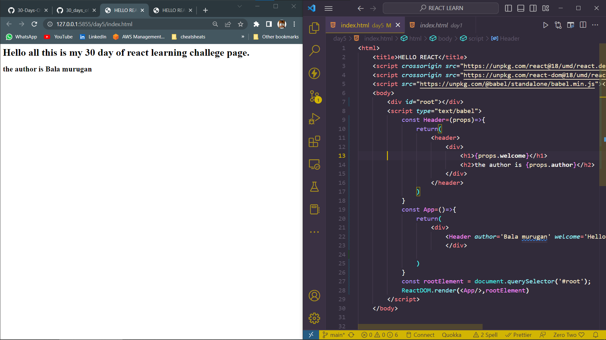
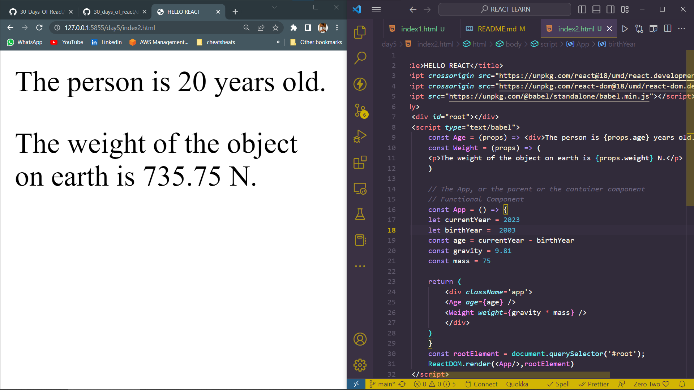
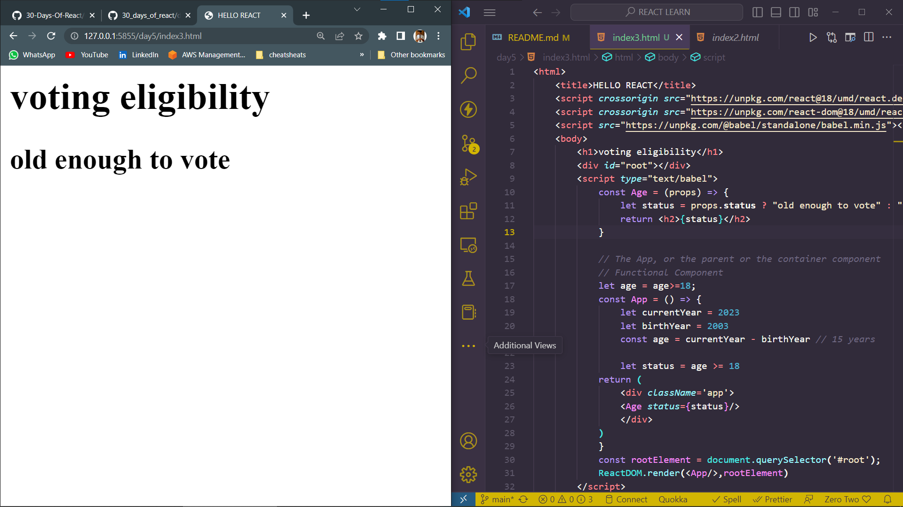
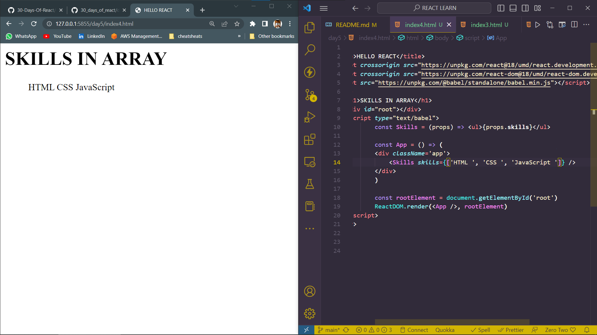

# DAY_5
# Date 30 June 2023 

# DATA DRIVEN COMPONENTS 
## PROPS
**Props is a special keyword in React that stands for properties and is being used to pass data from one component to another and mostly from parent component to child component. We can say props is a data carrier or a means to transport data.**

*EXAMPLE FOR PROPS*
```
// function syntax
const getUserInfo = (firstName,lastName,country)=>{
    return `${firstName} ${lastName}. Lives in ${country}` 
}
// calling a functons
getUserInfo('Bala','G','India')

//component syntax

// User component, component should start with an uppercase
const User = (props) => {
  return (
    <div>
      <h1>
        {props.firstName}
        {props.lastName}
      </h1>
      <small>{props.country}</small>
    </div>
  )
}
// calling or instantiating a component, this component has three properties and we call them props:firstName, lastName, country
<User firstName = 'Asabeneh', lastName='Yetayeh' country = 'Finland' />

```

*props Passing to actual components*


*Props of string type*


*Props of number type*


*Props of boolean type*



*Props of Array*


*Props of object*
### We may pass an object as props to a React component.


