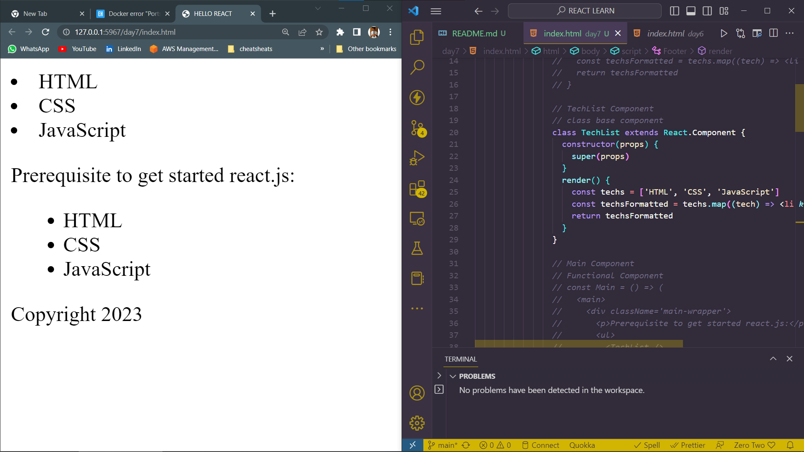
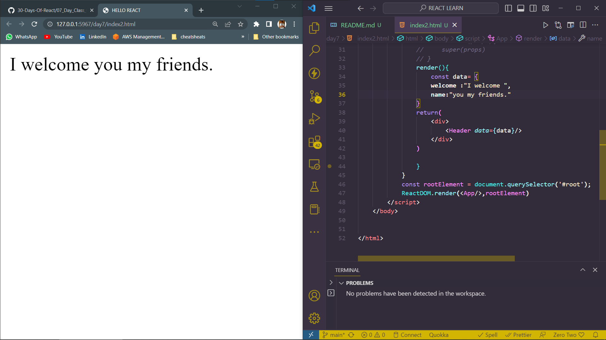

# DAY_7
# Date 02 July 2023 

# CLASS COMPONENTS

**Let us make also class based component. Class based component is made using JavaScript class and it inherits from react Component.**

*First we should know the different between functional react component and Class based react component*

## Functional React Component

```
import React from 'react';
import ReactDOM from 'react-dom';

const Header=()={
    <header>
    <div className="header-wrapper">
        <h1>Hello all welcome</h1>
    </div>
    </header>
}
const rootElement = document.getElementById('root');
ReactDOM.render(<Header/>,rootElement)
```

## Class based React Component is a child of React.Component and it has a built-in render method and it may have a constructor. 

```
import React from 'react';
import ReactDOM from 'react-dom';

class Header extends React.Component{
    render(){
    <header>
    <div className="header-wrapper">
        <h1>Hello all welcome</h1>
    </div>
    </header>
    }
}
const rootElement = document.getElementById('root')
ReactDOM.render(<Header />, rootElement)
```

## Class components with CONSTRUCTOR inside 
```
import React from 'react';
import ReactDOM from 'react-dom';

class Header extends React.Component{
    constructor(props){
        super(props)
        // THE CODE THAT WE PLACE HERE WILL EXECUTE ON FIRST HAND
    }
    render(){
    <header>
    <div className="header-wrapper">
        <h1>Hello all welcome</h1>
    </div>
    </header>
    }
    
}
const rootElement= document.getElementById('root');
React.render(<Header/>,rootElement);
```

*conversion of functional component to class component in react*
```
// TechList Component
// functional component
const TechList = () => {
  const techs = ['HTML', 'CSS', 'JavaScript']
  const techsFormatted = techs.map((tech) => <li key={tech}>{tech}</li>)
  return techsFormatted
}

// TechList Component
// class base component
class TechList extends React.Component {
  constructor(props) {
    super(props)
  }
  render() {
    const techs = ['HTML', 'CSS', 'JavaScript']
    const techsFormatted = techs.map((tech) => <li key={tech}>{tech}</li>)
    return techsFormatted
  }
}

// Main Component
// Functional Component
const Main = () => (
  <main>
    <div className='main-wrapper'>
      <p>Prerequisite to get started react.js:</p>
      <ul>
        <TechList />
      </ul>
    </div>
  </main>
)

// Main Component
// Class Component
class Main extends React.Component {
  constructor(props) {
    super(props)
  }
  render() {
    return (
      <main>
        <div className='main-wrapper'>
          <p>Prerequisite to get started react.js:</p>
          <ul>
            <TechList />
          </ul>
        </div>
      </main>
    )
  }
}

// Footer Component
// Functional component
const Footer = () => (
  <footer>
    <div className='footer-wrapper'>
      <p>Copyright 2020</p>
    </div>
  </footer>
)

// Footer Component
// Class component
class Footer extends React.Component {
  constructor(props) {
    super(props)
  }
  render() {
    return (
      <footer>
        <div className='footer-wrapper'>
          <p>Copyright 2020</p>
        </div>
      </footer>
    )
  }
}

// The App, or the parent or the container component
// Functional Component
const App = () => (
  <div className='app'>
    <Header />
    <Main />
    <Footer />
  </div>
)

// The App, or the parent or the container component
// Class Component
class App extends React.Component {
  constructor(props) {
    super(props)
  }
  render() {
    return (
      <div className='app'>
        <Header />
        <Main />
        <Footer />
      </div>
    )
  }
}
```
*Output of the above*



## Accessing props in Class components 

```

<html>
    <title>HELLO REACT</title>
    <script crossorigin src="https://unpkg.com/react@17/umd/react.development.js"></script>
    <script crossorigin src="https://unpkg.com/react-dom@17/umd/react-dom.development.js"></script>
    <script src="https://unpkg.com/@babel/standalone/babel.min.js"></script>
    <body>
        <div id="root"></div>
        <script type="text/babel">
            class Header extends React.Component{
                constructor(props){
                    super(props)
                }
                render(){
                    const {
                        welcome,
                        name
                    } = this.props.data;
                    return(
                        <header>
                            <div>
                                {welcome} {name}
                            </div>
                            
                        </header>
                    )
                }
            }
            class App extends React.Component{
                // constructor(props){
                //     super(props)
                // }
                render(){
                    const data= {
                    welcome :"I welcome ",
                    name:"you my friends."
                }
                return(
                    <div>
                        <Header data={data}/>
                    </div>
                )

                }  
            }
            const rootElement = document.querySelector('#root');
            ReactDOM.render(<App/>,rootElement)
        </script>
    </body>


</html>
```
*output of the above*



