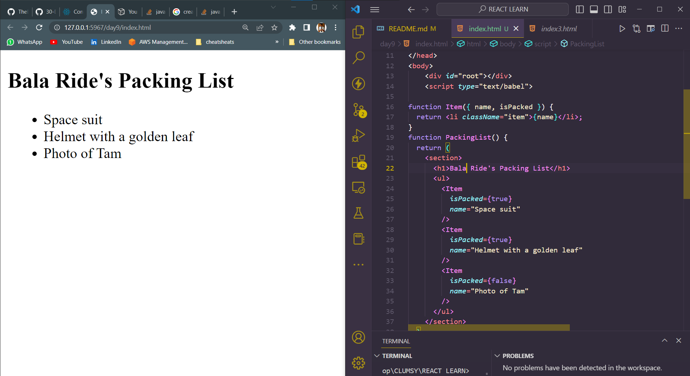
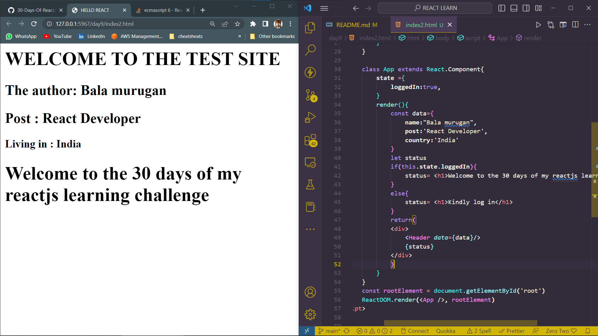
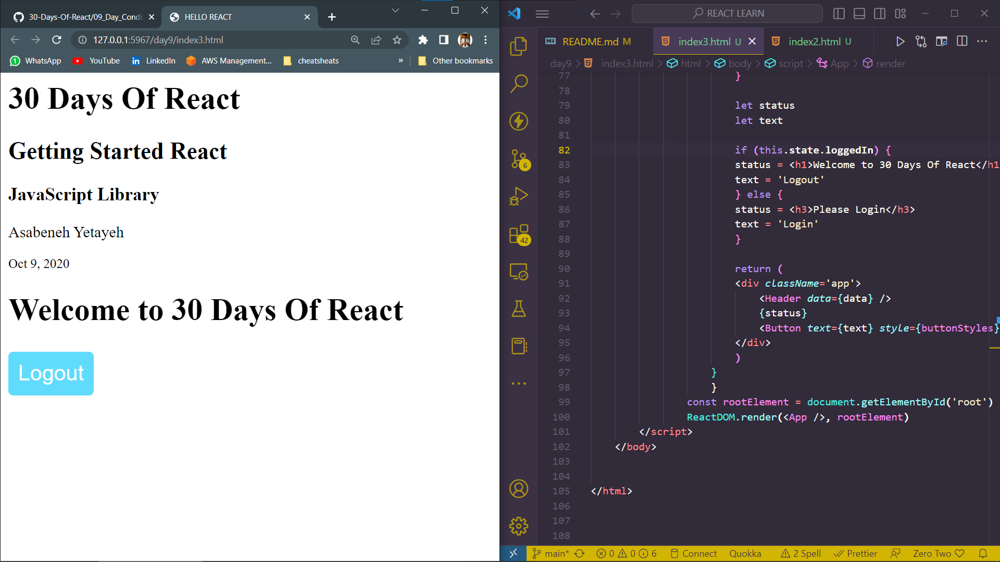

# DAY_9
# Date 04 July 2023 

# CONDITIONAL RENDERING 
**As we can understand from the term, conditional rendering is a way to render different JSX or component at different condition. We can implement conditional rendering using regular if and else statement, ternary operator and &&.**

*Your components will often need to display different things depending on different conditions. In React, you can conditionally render JSX using JavaScript syntax like if statements, &&, and ? : operators.*

## Conditional returning  JSX

```
<!DOCTYPE html>
<html lang="en">
<head>
    <meta charset="UTF-8">
    <meta name="viewport" content="width=device-width, initial-scale=1.0">
    <script crossorigin src="https://unpkg.com/react@17/umd/react.development.js"></script>
    <script crossorigin src="https://unpkg.com/react-dom@17/umd/react-dom.development.js"></script>
    <script src="https://unpkg.com/@babel/standalone/babel.min.js"></script>
    <script src="/bundle.js"></script>
    <title>Document</title>
</head>
<body>
    <div id="root"></div>
    <script type="text/babel">

function Item({ name, isPacked }) {
  return <li className="item">{name}</li>;
}
function PackingList() {
  return (
    <section>
      <h1>Bala Ride's Packing List</h1>
      <ul>
        <Item 
          isPacked={true} 
          name="Space suit" 
        />
        <Item 
          isPacked={true} 
          name="Helmet with a golden leaf" 
        />
        <Item 
          isPacked={false} 
          name="Photo of Tam" 
        />
      </ul>
    </section>
  );
}
        const rootElement = document.getElementById('root')
        ReactDOM.render(<PackingList/>, rootElement)
    </script>
</body>
</html>
```
  

## Conditional Rendering using If and Else statement

**In the code below we are going to check the logged in status of the user**
```

<html>
    <title>HELLO REACT</title>
    <script crossorigin src="https://unpkg.com/react@17/umd/react.development.js"></script>
    <script crossorigin src="https://unpkg.com/react-dom@17/umd/react-dom.development.js"></script>
    <script src="https://unpkg.com/@babel/standalone/babel.min.js"></script>
    <body>
        <div id="root"></div>
        <script type="text/babel">
                class Header extends React.Component{
                    render(){
                        const {
                        name,
                        post,
                        country,
                    } = this.props.data; 
                        return(
                            <header>
                                <div>
                                <h1>WELCOME TO THE TEST SITE</h1>
                                <h2>The author: {name}</h2>
                                <h2>Post      : {post}</h2>
                                <h3>Living in : {country}</h3>
                                </div>
                            </header>
                        )
                    }
                }

                class App extends React.Component{
                    state ={
                        loggedIn:true,
                    }
                    render(){
                        const data={
                            name:"Bala murugan",
                            post:'React Developer',
                            country:'India'
                        }
                        let status
                        if(this.state.loggedIn){
                            status= <h1>Welcome to the 30 days of my reactjs learning challenge</h1>
                        }
                        else{
                            status= <h1>Kindly log in</h1>
                        }
                        return(
                        <div>
                            <Header data={data}/>
                            {status}
                        </div>
                        )
                    }
                }
                const rootElement = document.getElementById('root')
                ReactDOM.render(<App />, rootElement)
        </script>
    </body>


</html>


```
*Output of the above code*



## Handling the state through toggle 
```

<html>
    <title>HELLO REACT</title>
    <script crossorigin src="https://unpkg.com/react@17/umd/react.development.js"></script>
    <script crossorigin src="https://unpkg.com/react-dom@17/umd/react-dom.development.js"></script>
    <script src="https://unpkg.com/@babel/standalone/babel.min.js"></script>
    <body>
        <div id="root"></div>
        <script type="text/babel">
                    // A button component
                    const Button = ({ text, onClick, style }) => (
                    <button style={style} onClick={onClick}>
                        {text}
                    </button>
                    )

                    // CSS styles in JavaScript Object
                    const buttonStyles = {
                    backgroundColor: '#61dbfb',
                    padding: 10,
                    border: 'none',
                    borderRadius: 5,
                    margin: '3px auto',
                    cursor: 'pointer',
                    fontSize: 22,
                    color: 'white',
                    }

                    // class based component
                    class Header extends React.Component {
                    render() {
                        console.log(this.props.data)
                        const {
                        welcome,
                        title,
                        subtitle,
                        author: { firstName, lastName },
                        date,
                        } = this.props.data

                        return (
                        <header>
                            <div className='header-wrapper'>
                            <h1>{welcome}</h1>
                            <h2>{title}</h2>
                            <h3>{subtitle}</h3>
                            <p>
                                {firstName} {lastName}
                            </p>
                            <small>{date}</small>
                            </div>
                        </header>
                        )
                    }
                    }

                    class App extends React.Component {
                    state = {
                        loggedIn: false,
                    }
                    handleLogin = () => {
                        this.setState({
                        loggedIn: !this.state.loggedIn,
                        })
                    }

                    render() {
                        const data = {
                        welcome: '30 Days Of React',
                        title: 'Getting Started React',
                        subtitle: 'JavaScript Library',
                        author: {
                            firstName: 'Asabeneh',
                            lastName: 'Yetayeh',
                        },
                        date: 'Oct 9, 2020',
                        }

                        let status
                        let text

                        if (this.state.loggedIn) {
                        status = <h1>Welcome to 30 Days Of React</h1>
                        text = 'Logout'
                        } else {
                        status = <h3>Please Login</h3>
                        text = 'Login'
                        }

                        return (
                        <div className='app'>
                            <Header data={data} />
                            {status}
                            <Button text={text} style={buttonStyles} onClick={this.handleLogin} />
                        </div>
                        )
                    }
                    }
                const rootElement = document.getElementById('root')
                ReactDOM.render(<App />, rootElement)
        </script>
    </body>


</html>


```

*output of the following *


